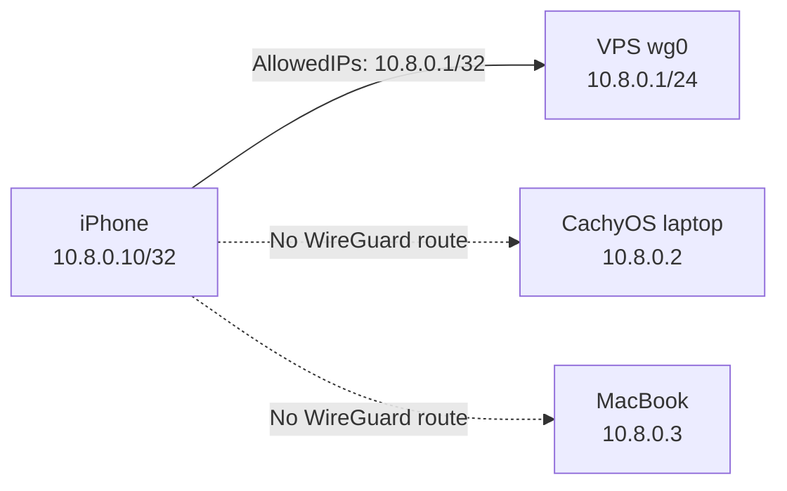

The iPhone is reserved as `10.8.0.10/32`. Its WireGuard peer advertises only
`10.8.0.1/32`, so the phone sends traffic to the VPS through the tunnel without
turning WireGuard into its default internet route. It receives no WireGuard
route to the CachyOS laptop or MacBook.

This page records desired state. The source configuration exists, but the peer
is not active until the iPhone generates a keypair, its public key is added to
the VPS, and runtime checks pass.

## Access boundary



Two layers provide client isolation:

1. The iPhone's `AllowedIPs = 10.8.0.1/32` installs only a host route to the
   VPS.
2. The VPS keeps its default UFW routed policy at `deny`, so it does not forward
   traffic between WireGuard clients.

This grants access to services reachable on the VPS's VPN address. It does not
restrict the phone to a particular VPS port or application. If that narrower
policy is needed later, add explicit UFW rules for `10.8.0.10` in a separate,
recovery-protected firewall change.

## Operational source

| File | Purpose |
| --- | --- |
| `zero-five-infra/wireguard/iphone.conf.example` | Exact iPhone address, VPS identity, endpoint, route, and keepalive |
| `zero-five-infra/wireguard/vps.conf.example` | Reserved iPhone peer and `10.8.0.10/32` route on the hub |
| `zero-five-infra/scripts/validate_wireguard.py` | Checks the fixed address, hub-and-spoke topology, routes, and key placeholders |
| `zero-five-infra/scripts/generate_iphone_wireguard_qr.sh` | Creates a temporary keypair and terminal-only import QR |

The examples never contain the iPhone private key. `IPHONE_PRIVATE_KEY` marks
the value retained by the iOS app, and `IPHONE_PUBLIC_KEY` marks the value that
must be copied from the app into the VPS peer entry. A WireGuard public key is
not secret, but the matching private key must never enter Git, chat, shell
history, screenshots, or documentation.

## Recommended: import a one-time QR code

The QR helper avoids manually copying the private configuration into the app.
It can generate the reserved iPhone peer or another mobile peer with a chosen
name and unique `10.8.0.x` address. It requires `wireguard-tools` and
`qrencode` on the MacBook:

```bash
brew install wireguard-tools qrencode
cd /Users/manuel/Desktop/zero-five/zero-five-infra
make iphone-qr
```

`wireguard/iphone.conf.example` is the default template. To use a separate
secret-free client template for another device:

```bash
make iphone-qr TEMPLATE=wireguard/another-phone.conf.example
```

The template supplies the default node name, default address, VPS peer,
endpoint, routes, and keepalive. It must keep the private key as an explicit
`*_PRIVATE_KEY` placeholder.

The helper first validates the tracked WireGuard source and lists the addresses
already assigned in `vps.conf.example`. It prompts for a device name and client
IP, refusing the VPS address, invalid host addresses, and addresses modeled for
another peer. Press Enter at both prompts to use the existing `iphone` and
`10.8.0.10` reservation. It creates a fresh private key in shell memory and a
mode-`0600` temporary configuration, then shows the configuration as a terminal
QR code. It never creates a persistent PNG.

The address list comes from tracked source and cannot detect an unrecorded live
VPS peer. Before activation, compare the chosen address with
`sudo wg show wg0 allowed-ips` on the VPS. The helper prints the exact runtime
`wg set` command and persistent peer block after the QR is cleared.

In the [official WireGuard app for iOS](https://www.wireguard.com/install/),
select **Add a tunnel**, then **Create from QR code**. Scan the terminal and
name the imported tunnel `zero-five`. After the import succeeds, press Enter on
the MacBook. The helper clears the QR, removes the temporary configuration, and
prints only the iPhone public key.

The QR contains the private key. Use a trusted terminal, do not photograph or
screen-record it, and remember that terminal software may retain scrollback.
Every invocation creates a new identity. After this identity is added to the
VPS, do not rerun the helper unless intentionally rotating that device's peer.

Replace `IPHONE_PUBLIC_KEY` in `wireguard/vps.conf.example` with the printed
public key, then run:

```bash
make validate
```

Continue with [Safe VPS deployment](#safe-vps-deployment).

### Adding another person's device

Choose a unique address that is not listed by the helper. The generated client
still receives only `AllowedIPs = 10.8.0.1/32`, so it has no WireGuard route to
the MacBook or other clients. Record the printed peer name, public key, and
`/32` in `zero-five-infra`, validate the complete topology, and use the same
runtime-first deployment and rollback sequence below.

Generating or scanning a QR is only the client half. The tunnel cannot
handshake until the matching public key and `/32` are added to the live VPS
interface and persistent `/etc/wireguard/wg0.conf`.

The current handbook middleware allows the entire `10.8.0.0/24` subnet. Every
person activated in this range can therefore open `docs.zero-five.space` and
other services available on the VPS VPN address. If someone should have a
different trust level, do not activate them in this range; first design a
separate restricted subnet or per-service firewall and Traefik policy.

## Alternative: create the tunnel manually

Install the [official WireGuard app for iOS](https://www.wireguard.com/install/).
Select **Add a tunnel**, then **Create from scratch**. Name the tunnel
`zero-five` and let the app generate the keypair.

Enter these interface settings:

| Field | Value |
| --- | --- |
| Addresses | `10.8.0.10/32` |
| Listen port | Automatic / empty |
| DNS servers | Empty |

Add one peer with these settings:

| Field | Value |
| --- | --- |
| Public key | VPS public key from `iphone.conf.example` |
| Endpoint | VPS endpoint from `iphone.conf.example` |
| Allowed IPs | `10.8.0.1/32` |
| Persistent keepalive | `25` seconds |

Do not use `0.0.0.0/0`: that would make the phone a full-tunnel client. Do not
add `10.8.0.0/24`: that would route the other VPN client addresses toward the
VPS. Leave on-demand activation disabled until manual verification succeeds.

Copy only the iPhone's **public key** from the app. Replace
`IPHONE_PUBLIC_KEY` in `wireguard/vps.conf.example` with it, then run:

```bash
cd /Users/manuel/Desktop/zero-five/zero-five-infra
make validate
```

## Safe VPS deployment

Do not combine this peer addition with firewall, SSH, DNS, or other WireGuard
changes.

1. Keep the existing VPS SSH connection open and establish a second session.
2. Create a root-only rollback copy:

```bash
sudo cp --preserve=all /etc/wireguard/wg0.conf \
  /etc/wireguard/wg0.conf.pre-iphone
sudo chmod 600 /etc/wireguard/wg0.conf.pre-iphone
```

3. Add the peer to runtime state first, substituting the public key copied from
   the app:

```bash
sudo wg set wg0 peer IPHONE_PUBLIC_KEY allowed-ips 10.8.0.10/32
```

4. Activate the tunnel on the iPhone. On the VPS, inspect the peer without
   exposing private configuration:

```bash
sudo wg show wg0
ip route get 10.8.0.10
sudo ufw status verbose
```

5. From the phone, open a known VPN-bound VPS service at `10.8.0.1`. For
   example, the Ollama tags endpoint is
   `http://10.8.0.1:11434/api/tags`. Confirm ordinary websites still use the
   normal Wi-Fi or cellular route.
6. Confirm the VPS shows a recent handshake and traffic counters for the new
   peer, while the existing peers remain healthy.
7. Only after those checks pass, add the same peer block to
   `/etc/wireguard/wg0.conf`. Preserve the existing interface and peer blocks,
   then confirm the file remains owned by root with mode `0600`.

A handshake proves that the keys and UDP path work. The service request proves
that routing and application access also work. Persistence remains unverified
until a controlled VPS reboot or service restart is tested later.

## Common failures

| Symptom | Likely check |
| --- | --- |
| QR imports but the phone shows no handshake | The generated public key and matching `/32` were not added to the live VPS peer list, or the wrong generated identity was registered |
| No handshake | Phone internet access, endpoint, UDP `51820`, or mismatched public keys |
| Handshake but no VPS service | `AllowedIPs`, VPS service binding, UFW, or service availability |
| Ordinary internet enters the tunnel | Allowed IPs is broader than `10.8.0.1/32` |
| Tunnel works on Wi-Fi but not cellular | Carrier network behavior, endpoint reachability, or keepalive |
| Peer disappears after VPS restart | Runtime peer was never added to `/etc/wireguard/wg0.conf` |

## Rollback and lost-phone response

Disable the tunnel on the iPhone, then remove only this runtime peer from the
VPS:

```bash
sudo wg set wg0 peer IPHONE_PUBLIC_KEY remove
```

Remove the iPhone peer block from `/etc/wireguard/wg0.conf`. If the persistent
edit is uncertain, restore `/etc/wireguard/wg0.conf.pre-iphone` from one of the
protected SSH sessions and restart `wg-quick@wg0`. Recheck the existing peers
and VPS services.

If the phone is lost, remove its peer from runtime and persistent VPS state
immediately. Deleting or disabling the tunnel only on a phone you no longer
control is not a recovery measure. A replacement phone must generate a new
keypair; never reuse an exported private key unless a deliberate secure backup
policy is introduced.
