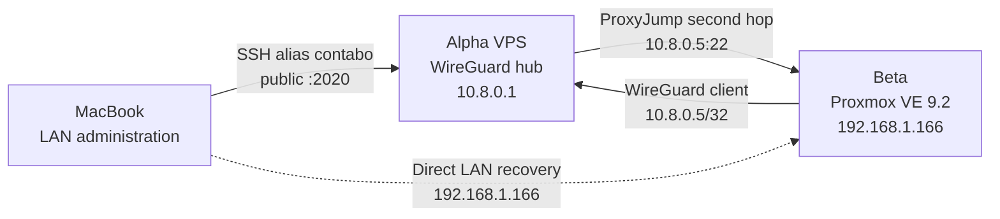

Beta is an HP 15 Notebook PC repurposed as the first Zero Five virtualization
host. It runs Proxmox VE as a standalone node on the home LAN. The initial
audit found a healthy, nearly empty installation: no cluster, guests, or custom
firewall rules exist yet.

## Architecture

The LAN remains Beta's recovery and management path. WireGuard is a narrow
client tunnel to Alpha, not a replacement default route and not a bridge for
the Proxmox LAN.

## Verified baseline

This state was observed live on 2026-07-22:

| Property | Verified state |
| --- | --- |
| Hardware | HP 15 Notebook PC; firmware `F.36` dated 2014-12-18 |
| CPU | Intel Core i7-4510U; 4 logical CPUs; VT-x enabled; `/dev/kvm` and `kvm_intel` verified after reboot |
| Memory | 7.7 GiB RAM and 7.7 GiB swap |
| Disk | 1 TB HGST HDD; SMART overall health passed; no pending, reallocated, or uncorrectable sectors |
| Boot | UEFI; Proxmox kernel `7.0.14-6-pve` |
| Platform | Proxmox VE `9.2.0`, manager `9.2.5`, Debian 13 `trixie` |
| LAN | Static `192.168.1.166/24` on bridge `vmbr0`; gateway and DNS `192.168.1.1` |
| WireGuard | Beta `wg0` at `10.8.0.5/32`; boot persistence, recent handshake, bidirectional ping, and private Handbook access verified after reboot |
| Mac SSH | `ssh beta` verified after reboot through `ProxyJump contabo`; Beta observed source `10.8.0.1` |
| Storage | `local` directory storage plus an empty `local-lvm` thin pool of about 795 GiB |
| Workloads | No QEMU virtual machines or LXC containers |
| Cluster | Standalone node; no Corosync configuration |
| Administration | Only local OS account `root`; only Proxmox user `root@pam`; no `manuel` account |
| Core services | Proxmox proxy, daemon, statistics daemon, and SSH enabled and active; no failed units |

## Important findings

1. **Hardware virtualization is enabled.** After the 2026-07-22 reboot, Linux
   reports VT-x, the `vmx` CPU flag, `/dev/kvm`, and loaded `kvm_intel` and
   `kvm` modules. The kernel also reports the CPU's L1TF mitigation as
   `SMT vulnerable`; assess the trust model before running untrusted guests.
2. **The Proxmox firewall is disabled.** The service is running, but policy is
   not enabled and no node or cluster firewall file was found.
3. **The configured time zone is `Europe/Stockholm`.** It currently shares the
   same UTC offset as Madrid, but the identity should be corrected if Beta is
   intended to follow the rest of the Zero Five estate.
4. **The disk needs normal old-hardware monitoring.** SMART passes and the key
   sector counters are zero. It records one historical airflow-temperature
   threshold event; the audit temperature was 41 C.

These are separate follow-up changes. They were not combined with the
WireGuard deployment so the recovery path stays simple.

## Recovery paths

- Normal SSH through Alpha: `ssh beta`
- Direct LAN SSH recovery: `ssh root@192.168.1.166`
- Proxmox UI: `https://192.168.1.166:8006`
- Physical keyboard and display on the HP laptop

`root` is the only available administrative account on Beta; `manuel` does not
exist. Remote SSH accepts public keys and rejects password authentication. Root
login is permitted with a key, not a password. Keep the LAN session or physical
console available while changing firmware virtualization, bridges, SSH, or
firewall policy.

## Documentation map

| Page | Use it for |
| --- | --- |
| [Configuration reference](/docs/laptop-beta/configuration-reference) | Exact deployed, generated, sensitive, and tracked paths for every Beta subsystem |
| [WireGuard](/docs/laptop-beta/wireguard) | Narrow peer design, deployed state, Alpha registration, verification, and rollback |
| [SSH through Alpha](/docs/laptop-beta/ssh) | Mac alias, two-hop behavior, host-key reuse, verification, recovery, and rollback |
| [Proxmox baseline](/docs/laptop-beta/proxmox) | Host, network bridge, storage, listeners, security posture, firmware, updates, and inspection |

## Next logical steps

1. Decide whether trusted-only workloads are sufficient or whether SMT should
   be disabled before running untrusted guests on this L1TF-affected CPU.
2. Correct the time zone as a separate reviewed change.
3. Design and enable Proxmox firewall policy before putting workloads on Beta.
4. Create a backup target before the first important VM or container.
