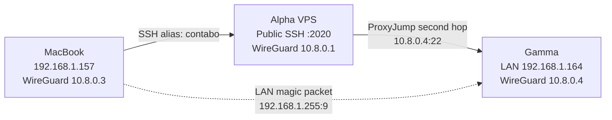

Gamma is an ASUS X555LJ rebuilt as a clean Ubuntu Server machine and the first
active Zero Five node physically inside the home network. Its erased operating
system and security incident remain in the
[Gamma archive](/docs/archive/laptop-gamma); no archived service or setting is
assumed to exist on this installation.

## Architecture



Alpha remains the WireGuard hub. Gamma routes only Alpha's private address
through the tunnel; it does not become a general internet gateway. The MacBook
uses Alpha as an SSH jump host because the hub firewall intentionally denies
general client-to-client forwarding.

Wake-on-LAN is separate from WireGuard. A suspended Gamma has no active tunnel,
so the MacBook sends a Layer-2 magic packet on the home LAN before attempting
VPN SSH.

## Verified state

The following state was observed live on 2026-07-22:

| Property | Verified state |
| --- | --- |
| Hardware | ASUS X555LJ; Realtek RTL8111/8168-family Ethernet |
| OS | Ubuntu 26.04 LTS, kernel `7.0.0-28-generic` |
| Hostname | `gamma` |
| LAN | `enp2s0`, DHCP address `192.168.1.164/24` |
| WireGuard | `wg0` at `10.8.0.4/32`; `wg-quick@wg0` enabled and active |
| VPN proof | Gamma pinged Alpha at `10.8.0.1`; Alpha pinged Gamma at `10.8.0.4` |
| SSH | `ssh gamma` verified through `ProxyJump contabo`; Gamma saw source `10.8.0.1` |
| SSH activation | `ssh.socket` enabled and active; `ssh.service` active through socket activation |
| Suspend policy | Lid, docked lid, external-power lid, and idle actions all resolve to `ignore` |
| Manual suspend | `/usr/local/sbin/gamma-suspend`, root-owned mode `0755` |
| Wake-on-LAN | Magic-packet wake verified from suspend; PCI wake enabled |
| Shutdown wake | Not supported by the observed firmware behavior |
| Boot fix | Record-failure timeout reduced to 5 seconds; `kho=off` active; KHO warnings absent |

Direct LAN SSH still functions as a recovery path. Do not call the LAN path
closed until the UFW restriction in the [SSH runbook](/docs/laptop-gamma/ssh)
has been applied and independently verified.

## Daily operation

When Gamma is awake, connect from the MacBook:

```bash
ssh gamma
```

Suspend it cleanly from any Gamma SSH session:

```bash
sudo gamma-suspend
```

That command detaches into systemd, closes every remote login session, confirms
they are gone, and suspends. The SSH clients close instead of hanging.

Wake Gamma while the MacBook is on the home LAN:

```bash
wakeonlan -i 192.168.1.255 -p 9 9c:5c:8e:29:1f:b0
```

Then wait for WireGuard and SSH:

```bash
ping -c 3 192.168.1.164
ssh gamma
```

Use `sudo systemctl poweroff` only when a physical power-on is acceptable.
Gamma wakes from suspend, not from full shutdown.

## Documentation map

| Page | Use it for |
| --- | --- |
| [Configuration reference](/docs/laptop-gamma/configuration-reference) | Every tracked, deployed, generated, and client-side path plus ownership rules |
| [WireGuard](/docs/laptop-gamma/wireguard) | Peer design, key handling, activation, persistence, verification, and rollback |
| [SSH over WireGuard](/docs/laptop-gamma/ssh) | Mac alias, jump-host behavior, host keys, firewall restriction, and recovery |
| [Boot and firmware](/docs/laptop-gamma/boot-and-firmware) | GRUB recordfail delay, KHO warnings, boot timing, TPM warnings, and rollback |
| [Wake-on-LAN](/docs/laptop-gamma/wake-on-lan) | WoL configuration, manual suspend command, automatic-suspend policy, testing, and limitations |

## Recovery priorities

1. Keep physical keyboard and display access available while changing boot,
   firewall, WireGuard, or suspend behavior.
2. Preserve a working LAN SSH session until the VPN path is proven from a
   second terminal.
3. Change only one risky subsystem at a time.
4. Never copy Gamma's WireGuard private key into Git, chat, notes, or Alpha.
5. Restore tracked configuration from `zero-five-infra`; do not treat generated
   files under `/run` or `/boot/grub/grub.cfg` as authored source.
