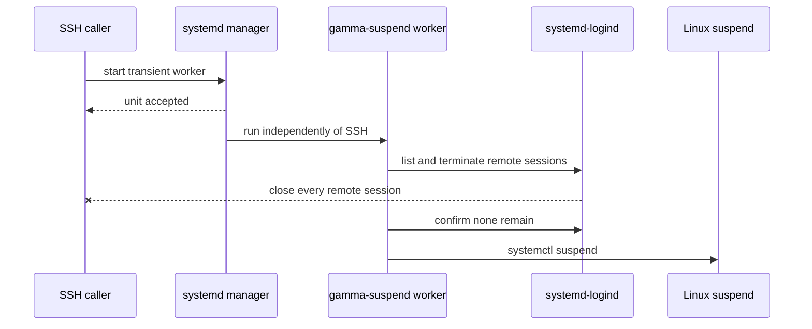

Gamma can be woken over Ethernet when it is **suspended**, but not after a full
shutdown. This distinction was tested on 2026-07-22 and defines the supported
power-management model for the laptop.

## Verified state

| Property | Value |
| --- | --- |
| Ethernet interface | `enp2s0` |
| Controller | Realtek RTL8111/8168/8211/8411 using `r8169` |
| MAC address | `9c:5c:8e:29:1f:b0` |
| LAN | `192.168.1.0/24` |
| Directed broadcast | `192.168.1.255` |
| Supported wake modes | `pumbg`, including `g` for a magic packet |
| Configured mode | `Wake-on: g` |
| PCI wake state | `enabled`, including after boot |
| Suspend wake | Verified working repeatedly |
| Full-shutdown wake | Does not work; firmware removes the usable wake path |
| Automatic suspend | Disabled for idle, lid, external-power lid, and docked lid |
| Manual suspend | `sudo gamma-suspend` installed and verified by location and mode |

Linux and Netplan correctly arm the Ethernet controller. The shutdown
limitation occurs after firmware takes control and removes the usable wake
path. Linux cannot wake a completely unpowered controller.

## Configuration locations

| Location | Purpose and status |
| --- | --- |
| `zero-five-infra/scripts/gamma-suspend.sh` | Reviewed operational source for the suspend command |
| `/usr/local/sbin/gamma-suspend` | Installed root-owned command, mode `0755`; verified live |
| `zero-five-infra/systemd/logind.conf.d/10-gamma-manual-suspend-only.conf` | Reviewed source for the automatic-suspend policy |
| `/etc/systemd/logind.conf.d/10-gamma-manual-suspend-only.conf` | Installed root-owned policy, mode `0644`; verified live |
| `/etc/netplan/00-installer-config.yaml` | Root-only persistent Ethernet and `wakeonlan` configuration |
| `/run/systemd/network/10-netplan-enp2s0.network` | Generated networkd state; never edit directly |
| `/sys/class/net/enp2s0/device/power/wakeup` | Live PCI wake state; expected value `enabled` |
| `/opt/homebrew/bin/wakeonlan` on the MacBook | Homebrew-installed magic-packet sender |

The temporary files `/home/manuel/gamma-suspend.sh` and
`/home/manuel/10-gamma-manual-suspend-only.conf` were removed after their
checksums matched the tracked source and their privileged copies were
installed.

## Enable magic-packet wake

The `g` flag means wake on a magic packet; `d` means disabled. Enable `g` in the
running NIC and persist it through Netplan:

```bash
sudo ethtool -s enp2s0 wol g
sudo netplan set ethernets.enp2s0.wakeonlan=true
sudo netplan generate
```

The first command changes runtime NIC state. Netplan preserves the setting and
generates systemd-networkd configuration for later boots. `netplan generate`
validates and regenerates configuration without intentionally bouncing the
active SSH connection.

Inspect the result:

```bash
sudo ethtool enp2s0 | grep -E 'Supports Wake-on|Wake-on|Link detected'
cat /sys/class/net/enp2s0/device/power/wakeup
sudo netplan get ethernets.enp2s0
```

Expected results include `Wake-on: g`, `Link detected: yes`, PCI wake
`enabled`, and Netplan `wakeonlan: true`.

## Install the safe suspend command

Running `systemctl suspend` directly inside an interactive SSH shell can leave
the Mac terminal waiting because Gamma sleeps before TCP closes cleanly. The
tracked `gamma-suspend` helper closes remote sessions first.

From the MacBook repository root, copy it through Alpha. Modern SFTP-based
`scp` closed the connection during this rollout, while legacy SCP mode worked
and checksum-verified, so use the verified mode explicitly:

```bash
scp -O \
  zero-five-infra/scripts/gamma-suspend.sh \
  gamma:/home/manuel/gamma-suspend.sh
```

Compare local and remote SHA-256 values:

```bash
shasum -a 256 zero-five-infra/scripts/gamma-suspend.sh
ssh gamma 'shasum -a 256 /home/manuel/gamma-suspend.sh'
```

On Gamma, install the exact verified file and remove only the staging copy:

```bash
sudo install \
  -o root -g root -m 0755 \
  /home/manuel/gamma-suspend.sh \
  /usr/local/sbin/gamma-suspend
rm /home/manuel/gamma-suspend.sh
```

`/usr/local/sbin/gamma-suspend` is now the deployed command; the repository
file remains the recoverable source.

## How `gamma-suspend` works

From any Gamma SSH session:

```bash
sudo gamma-suspend
```

The command hands execution to the system manager. Its detached worker finds
every login session marked remote by `systemd-logind`, terminates them, confirms
that none remain, and then invokes `systemctl suspend`.



Killing the initiating SSH session cannot cancel the system worker. If any
remote session remains after twenty checks over five seconds, the worker exits
with an error and leaves Gamma awake.

No permanent custom service is installed. Each invocation creates a transient
`gamma-suspend-worker.service`; systemd collects it after Gamma wakes and the
suspend call returns. While it remains available, inspect its log with:

```bash
journalctl -u gamma-suspend-worker.service --no-pager
```

## Prevent every automatic suspend trigger

Gamma is a server. Idle time and closing the lid must not suspend it; the only
supported trigger is `sudo gamma-suspend`.

The tracked logind drop-in contains:

```ini
[Login]
HandleLidSwitch=ignore
HandleLidSwitchExternalPower=ignore
HandleLidSwitchDocked=ignore
IdleAction=ignore
```

Copy and checksum it from the MacBook:

```bash
scp -O \
  zero-five-infra/systemd/logind.conf.d/10-gamma-manual-suspend-only.conf \
  gamma:/home/manuel/10-gamma-manual-suspend-only.conf
shasum -a 256 \
  zero-five-infra/systemd/logind.conf.d/10-gamma-manual-suspend-only.conf
ssh gamma \
  'shasum -a 256 /home/manuel/10-gamma-manual-suspend-only.conf'
```

On Gamma, install it, reload logind without rebooting, and remove the staging
copy:

```bash
sudo install \
  -o root -g root -m 0644 -D \
  /home/manuel/10-gamma-manual-suspend-only.conf \
  /etc/systemd/logind.conf.d/10-gamma-manual-suspend-only.conf
sudo systemctl reload systemd-logind
rm /home/manuel/10-gamma-manual-suspend-only.conf
```

Inspect the effective live policy:

```bash
busctl get-property \
  org.freedesktop.login1 \
  /org/freedesktop/login1 \
  org.freedesktop.login1.Manager \
  HandleLidSwitch HandleLidSwitchExternalPower HandleLidSwitchDocked IdleAction
```

Live verification returned four `ignore` strings. Gamma had no automatic
suspend timers, and `IdleAction` was already `ignore`; the drop-in makes every
lid condition explicit. Do not mask `sleep.target` or `suspend.target`, because
that would also break intentional suspension.

## Wake Gamma from the MacBook

The MacBook must be on the same `192.168.1.0/24` LAN. Install the sender once:

```bash
brew install wakeonlan
```

Send Gamma's magic packet:

```bash
wakeonlan -i 192.168.1.255 -p 9 9c:5c:8e:29:1f:b0
```

The broadcast address is required because a suspended machine does not answer
ARP. Port `9` is conventional for WoL; it is not an application listening port
on Gamma.

## Complete operating cycle

From an active Gamma SSH session:

```bash
sudo gamma-suspend
```

The SSH clients should close. From the MacBook:

```bash
wakeonlan -i 192.168.1.255 -p 9 9c:5c:8e:29:1f:b0
ping -c 3 192.168.1.164
ssh gamma
```

After reconnecting on Gamma:

```bash
systemctl is-active wg-quick@wg0
ping -c 3 10.8.0.1
```

This verifies the whole chain: magic packet, resume, Ethernet, WireGuard,
Alpha reachability, ProxyJump, SSH socket activation, and the manual-only power
policy.

## Why shutdown wake is unsupported

The ASUS X555-series BIOS does not expose the desktop-style `Power On By
PCI-E` or `ErP` controls on this machine. Its documented Advanced page may
contain `Power Off Energy Saving`, but full-shutdown wake remained unavailable.

The practical rule is:

- suspend when Gamma must be wakeable from the home LAN;
- power off when maximum power saving matters and physical power-on is
  acceptable.

The absence of visible Ethernet LEDs does not change the verified functional
test: suspend wake succeeds and shutdown wake fails.

## Network boundary

Wake-on-LAN is a local Layer-2 broadcast. While Gamma sleeps, its WireGuard
tunnel is down, and Alpha has no path onto the home Ethernet broadcast domain.
The MacBook can wake Gamma only while connected to the home LAN.

Waking Gamma while away would require a separate always-on device or a trusted
router capability inside the home network. Do not forward UDP port 9 from the
public internet as a substitute for a trusted internal wake relay.

## Troubleshooting

| Symptom | Check |
| --- | --- |
| No wake from suspend | Confirm `Wake-on: g`, PCI wake `enabled`, Ethernet connected, and destination `192.168.1.255` |
| Wakes from suspend but not shutdown | Expected firmware limitation; continue using suspend |
| Packet sends but Gamma remains asleep | Confirm the Mac is on `192.168.1.0/24` and uses the wired NIC MAC, not Wi-Fi |
| Gamma wakes but `ssh gamma` initially fails | Wait for `wg-quick@wg0` and SSH socket activation, then retry |
| `gamma-suspend` refuses to suspend | Inspect `loginctl list-sessions`; do not force suspend with a remote session present |
| Terminal hangs after direct `systemctl suspend` | Use `sudo gamma-suspend`; the direct command sleeps before TCP closes |

## Rollback

Disable WoL intentionally:

```bash
sudo ethtool -s enp2s0 wol d
sudo netplan set ethernets.enp2s0.wakeonlan=false
sudo netplan generate
```

Disable the manual-only logind policy without destroying it:

```bash
sudo mv \
  /etc/systemd/logind.conf.d/10-gamma-manual-suspend-only.conf \
  /etc/systemd/logind.conf.d/10-gamma-manual-suspend-only.conf.disabled
sudo systemctl reload systemd-logind
```

Disable the helper while retaining a recoverable installed copy:

```bash
sudo mv \
  /usr/local/sbin/gamma-suspend \
  /usr/local/sbin/gamma-suspend.disabled
```

Rollback should be performed from the physical console if changing the power
policy could make remote access unreliable.
