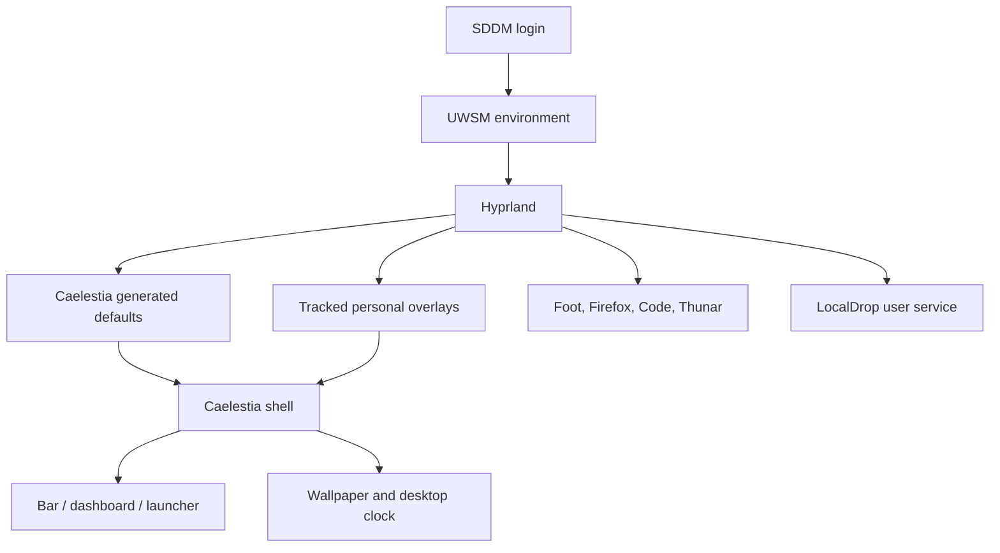
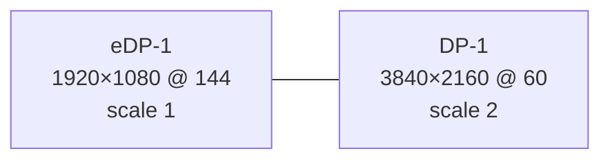

The MSI uses CachyOS with Hyprland `0.56.2-1`, Caelestia shell `2.2.0-1`, and
Caelestia CLI `1.1.2-1`. Caelestia supplies generated defaults; the personal
choices are tracked in `zero-five-infra/settings/msi/caelestia/` and
`settings/msi/hypr/`.

## Session flow



The session environment selects Wayland toolkit backends and the `qtengine`
theme. Hyprland then loads the Caelestia-generated modules and the personal
monitor, variable, and keybind overrides.

## Monitor layout

| Output | Mode | Position | Scale |
| --- | --- | --- | --- |
| `eDP-1` | `1920x1080@144` | `0x0` | `1` |
| `DP-1` | `3840x2160@60` | `1920x0` | `2` |



The monitor names are hardware-dependent. If the laptop boots with a dock or
different cable, check `hyprctl monitors` before changing the override. A
wrong output name can leave the external display unconfigured without
breaking the operating system.

## Appearance and behavior

The personal overlay records:

- Foot as terminal, Firefox as browser, Codium as editor, and Thunar as file
  manager in the Lua configuration;
- 20 workspace gaps, 5 inner window gaps, 10 outer gaps, 15px rounding, 95%
  window opacity, blur, shadows, and a `sweet-cursors` cursor at size 24;
- four-finger workspace swipes and three-finger gestures;
- media, screenshot, clipboard, emoji, session, lock, and workspace bindings;
- a 60 FPS Cava visualizer with smooth noise reduction and Caelestia colors;
- a Foot terminal with Fish, JetBrains Mono Nerd Font size 12, 10,000 lines of
  scrollback, and translucent blurred background;
- a Fuzzel launcher with Foot as its terminal, 15 visible lines, and the
  Caelestia palette;
- a btop Caelestia theme with CPU, memory, network, process, disk, GPU, and
  temperature information enabled.

The shell override enables transparency, wallpaper, desktop clock, visualizer,
date, Wi-Fi/audio/microphone/lock indicators, five workspaces, lyrics, and a
Firefox favorite. The launcher includes settings, wallpaper, scheme, power,
lock, sleep, and LocalDrop send-file actions.

## Suspend and resume

The Quickshell process behind Caelestia can crash when its Wayland layer-shell
panels survive a suspend/resume cycle. The tracked
`caelestia-suspend-watchdog.service` closes Caelestia before sleep and starts a
fresh shell one second after resume. This avoids reusing stale Wayland surfaces
while leaving Hyprland and user applications running.

The lock command uses Hyprlock, not Caelestia's lock surface. Install the
official `hyprlock` package and restore `~/.config/hypr/hyprlock.conf`; the
lock fallback to Caelestia is only for systems where Hyprlock is unavailable.

## Personal keybinds

| Action | Binding |
| --- | --- |
| Launcher | `Super + Space` |
| Close window | `Super + Q` |
| Terminal | `Super + T` |
| Editor | `Super + C` |

The larger keymap comes from the generated Caelestia defaults and the tracked
Hyprland variables. Inspect effective bindings with `hyprctl binds`; do not
assume the generated `.conf` and Lua variants are both active in a given
session.

## Wallpapers and themes

Hyprpaper points both outputs to `~/Pictures/Wallpapers`. The wallpaper files
are not in Git because they are personal media and can be large. Restore that
directory separately, then check:

```bash
hyprctl hyprpaper listloaded
caelestia wallpaper -r
```

The tracked theme files cover btop, GTK, Qt, and editor integration. They do
not replace the Caelestia package or its generated palette.

## Troubleshooting and rollback

```bash
hyprctl monitors
hyprctl reload
journalctl --user -b | rg -i 'hypr|caelestia|uwsm'
```

If a new personal overlay breaks the session, use a TTY or an existing SSH
session, move only the changed file aside, and reload Hyprland. Do not delete
the complete `~/.config/hypr` tree; generated defaults can be restored by
reinstalling the owning package.
