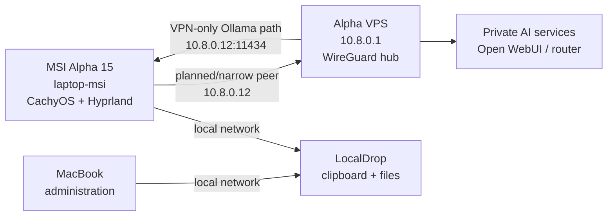

The MSI laptop is documented as **MSI**, or `laptop-msi` in handbook paths.
The name `Alpha` remains reserved for the VPS because Alpha is the WireGuard
hub and public service entry point.

## Current status

The reproducible, secret-free settings snapshot lives in
[`zero-five-infra/settings/msi/`](https://github.com/Manuel0516/zero-five-infra/tree/main/settings/msi).
This page explains the machine; the infrastructure repository carries the
restorable source files.

## Role in Zero Five



The MSI is primarily a personal Linux desktop. It also has the planned shape
of a second AI backend: the VPS router can reach `10.8.0.12:11434` over
WireGuard when the laptop peer and Ollama service are actually enabled. The
2026-08-07 inventory found no local Ollama models, so that backend is not
currently a verified deployed capability.

| Property | State |
| --- | --- |
| Handbook identity | `laptop-msi` |
| Hardware | MSI Alpha 15 A4DEK |
| Hostname | `msi` (renamed from `alpha` on 2026-08-12) |
| Operating system | CachyOS Linux, rolling release |
| LAN address | Not yet verified |
| WireGuard | MSI migration target at `10.8.0.12/32`; live cutover pending |
| Role | Personal Linux desktop and prospective laptop AI backend |

## Naming convention

Machine names describe their role in the estate where that role is stable:

| Name | Role |
| --- | --- |
| Alpha | VPS and WireGuard hub |
| Beta | Proxmox laptop; SSH access uses the `root` account |
| Gamma | Homelab laptop/server |
| MSI | MSI laptop; role not yet assigned |

Using `msi` avoids renaming the VPS and avoids assigning the MSI a role it may
not keep. If the laptop later becomes a defined service node, its operational
hostname and handbook title can be updated in one reviewed change.

## Documentation map

| Page | Use it for |
| --- | --- |
| [Configuration reference](/docs/laptop-msi/configuration-reference) | Ownership and exact paths for captured settings and excluded state |
| [Desktop](/docs/laptop-msi/desktop) | Hyprland, Caelestia, monitors, keybinds, themes, and session environment |
| [WireGuard](/docs/laptop-msi/wireguard) | MSI peer migration to `10.8.0.12`, narrow routing, verification, and rollback |
| [Ollama](/docs/laptop-msi/ollama) | Native service, VPN binding, model inventory, and AI-stack relationship |
| [LocalDrop](/docs/laptop-msi/localdrop) | Clipboard/file sync project, secret-bearing config, systemd, and recovery |
| [Tools](/docs/laptop-msi/tools) | Packages, terminals, editors, and reproducible user tooling |
| [Recovery](/docs/laptop-msi/recovery) | Fresh-install sequence and what still needs manual restoration |

## First inventory

Record these from the laptop before adding deployment or network configuration:

```bash
hostnamectl
cat /etc/os-release
ip -brief address
free -h
lsblk -o NAME,SIZE,MODEL,TYPE,MOUNTPOINTS
```

Do not copy private keys, tokens, or full secret-bearing configuration output
into the handbook or `zero-five-infra`.

## Rebuild

Follow [`settings/msi/README.md`](https://github.com/Manuel0516/zero-five-infra/tree/main/settings/msi)
for the package manifest, desktop settings, editor settings, Ollama notes,
secret exclusions, and post-restore verification. The snapshot restores the
durable configuration layer; it does not contain personal data, secrets,
wallpapers, project repositories, or AI model blobs.

## Next steps

1. Confirm the exact MSI model and operating system.
2. Decide whether it is a workstation, a WireGuard client, or a service node.
3. If it needs Zero Five network access, add a secret-free peer template under
   `zero-five-infra/wireguard/` and document its verified route here.
