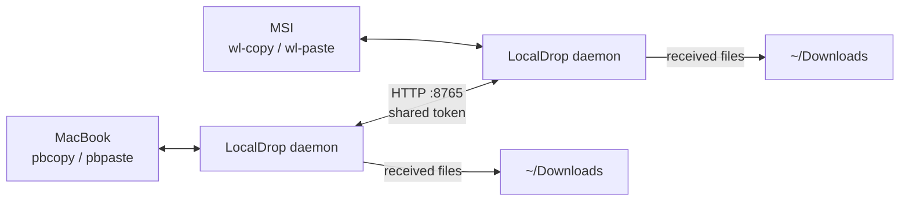

LocalDrop is a small Python project that runs a daemon on the MSI and MacBook.
Each daemon both serves HTTP requests and polls its local clipboard:



It is plain HTTP with a shared token for a trusted LAN. It is not encrypted
and must never be exposed to the internet.

## MSI installation

The project is expected at `~/projects/localdrop`. The tracked user unit is
`zero-five-infra/settings/msi/services/localdrop.service` and expands `%h` to
the home directory:

```ini
[Service]
Environment=PYTHONUNBUFFERED=1
ExecStart=/usr/bin/python %h/projects/localdrop/main.py daemon
WorkingDirectory=%h/projects/localdrop
Restart=always
RestartSec=3
```

The service starts with the graphical session so Wayland clipboard variables
are available. The live `~/projects/localdrop/config.toml` is intentionally
not copied because its `shared_token` is a secret.

## Restore

```bash
mkdir -p ~/projects
git clone https://github.com/Manuel0516/localdrop ~/projects/localdrop
cd ~/projects/localdrop
cp examples/config.example.toml config.toml
# Edit config.toml manually; create a new shared token and set the peer LAN IP.
systemctl --user daemon-reload
systemctl --user enable --now localdrop.service
```

Install the Linux dependencies first:

```bash
sudo pacman -S --needed python wl-clipboard libnotify zenity
```

Set the MSI as the Linux device and the MacBook as its peer. Keep the token
identical on both machines, but never put it in the handbook or infra repo.
The peer addresses are **static private IPs**: the MSI listens on `0.0.0.0`
and points `peer.host` at the MacBook's static `192.168.1.109`; the MacBook
listens on `0.0.0.0` and points `peer.host` at the MSI's static
`192.168.1.110`. Because these are reserved (static) in the router's DHCP,
they never go stale across restarts — the reliable, simple 1:1 LocalDrop model
(MSI ⇄ MacBook over the LAN). The mesh/Delta relay and phone push are
documented separately.

## Operations

```bash
cd ~/projects/localdrop
python3 main.py ping
python3 main.py send ~/path/to/file.png
journalctl --user -u localdrop.service -f
```

The Caelestia launcher includes a send-file action pointing at the project's
Linux send script. The tracked Hyprland/Caelestia snapshot preserves that
integration path, but the project and token are restored separately.

## Troubleshooting

1. Run `python3 main.py ping` from both devices.
2. Check both `peer.host` values against current LAN addresses.
3. Check `systemctl --user status localdrop.service` and its journal.
4. If requests return `401`, create one new token and set it on both devices.
5. Confirm `wl-copy` and `wl-paste` work inside the graphical Wayland session.

Do not open port `8765` on the router. If the LAN is untrusted, stop the
daemon until LocalDrop gains an encrypted transport or a restricted network.
