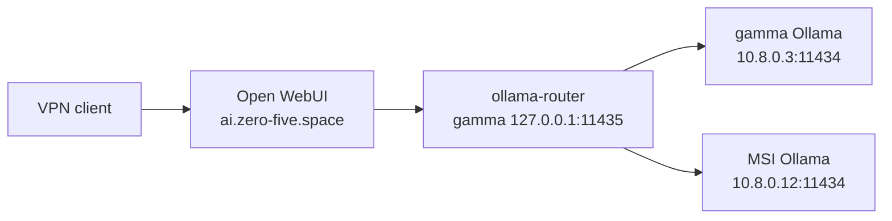

## Role

The personal-ai router on **gamma** is designed to merge models from two Ollama
backends:



The MSI backend is private and reachable only through the WireGuard route.
Since 2026-08-24 the laptop branch is **live**: `deepseek-r1:7b` and
`qwen2.5-coder:7b` are deployed and merged by the gamma router (see
[gamma AI stack](/docs/laptop-gamma/ai-stack)).

## Captured service configuration

The native service runs `/usr/local/bin/ollama serve` as the dedicated
`ollama` user. Its non-secret drop-in records:

```ini
[Unit]
Wants=wg-quick@wg0.service
After=wg-quick@wg0.service

[Service]
Environment="OLLAMA_HOST=10.8.0.12:11434"
Environment="OLLAMA_KEEP_ALIVE=1m"
Environment="OLLAMA_NUM_CTX=65536"
```

MSI's UFW permits TCP `11434` on `wg0` from gamma's `10.8.0.3/32` and
alpha's `10.8.0.1/32` sources:

```bash
sudo ufw allow in on wg0 from 10.8.0.1 to any port 11434 proto tcp
sudo ufw allow in on wg0 from 10.8.0.3 to any port 11434 proto tcp
sudo ufw reload
```

This is required for the gamma personal-ai router (and the alpha fallback);
the Ollama port remains closed on the LAN and public interfaces.

The service source and drop-in examples are tracked under
`zero-five-infra/settings/msi/ai/`. The actual system unit and any package
installer state remain on the machine; do not replace them blindly.

## Model inventory

At capture time:

| Machine | Models |
| --- | --- |
| MSI | None listed; no model blobs present |
| Alpha | See [Alpha Ollama](/docs/vps-alpha/ollama) for the VPS inventory |

Pulling a model is an operational change. Record its exact tag, purpose,
approximate size, context requirements, and whether Alpha's router maps to it.
Never commit the Ollama identity or model storage directory.

## Inspect

```bash
systemctl status ollama --no-pager
systemctl cat ollama
ollama list
ollama ps
curl --fail http://10.8.0.12:11434/api/tags
```

If `ollama list` uses localhost unexpectedly, set the client endpoint only for
the current shell:

```bash
OLLAMA_HOST=10.8.0.12:11434 ollama list
```

## Restore

1. Install Ollama using the reviewed upstream installer.
2. Install and review the tracked service/drop-in examples.
3. Bring up and verify WireGuard first; Ollama cannot bind to `10.8.0.12`
   while that address is absent.
4. Start Ollama and verify `/api/tags` locally.
5. Pull only the required models and record them in the settings inventory.
6. From Alpha, verify the laptop backend and router health.

## Failure modes

| Symptom | Likely cause | Check |
| --- | --- | --- |
| Service fails to start | `wg0` or `10.8.0.12` absent | `ip address show wg0`, `journalctl -u ollama -b` |
| Local tags work but Alpha cannot see models | WireGuard route, UFW rule, or bind address | `ping 10.8.0.1`, `sudo ufw status`, `curl http://10.8.0.12:11434/api/tags` from Alpha |
| Model is missing | No model was pulled or inventory is stale | `ollama list`, then update the tracked inventory |
| Memory pressure | Large model/context competing with desktop | `ollama ps`, `free -h`, lower context or stop the model |

Rollback is service-local: stop Ollama or remove only the MSI backend from
Alpha's router configuration. Do not change Alpha's own Ollama or WireGuard
peer policy while diagnosing the laptop.
