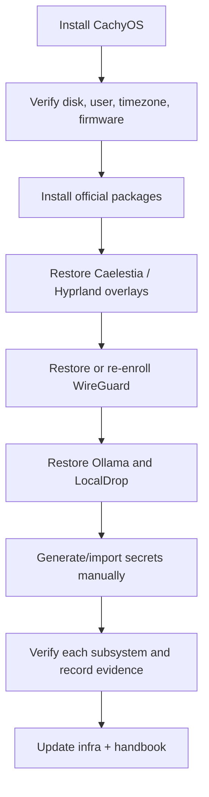

The two repositories can restore the durable configuration layer quickly, but
they cannot recreate private identities, personal data, project source,
wallpapers, browser accounts, LocalDrop's token, or Ollama model blobs. Those
must be restored from separate backups or generated again.

## Recovery sequence



## Fast path

1. Install CachyOS and create the `manuel` user.
2. Restore network access and clone both repositories.
3. Follow `zero-five-infra/settings/msi/README.md` for official packages and
   settings.
4. Restore wallpapers and `~/projects/localdrop` from trusted sources.
5. Generate a new SSH key, GPG identity if needed, WireGuard private key, and
   LocalDrop shared token. Never reuse leaked laptop secrets.
6. Verify the desktop, LocalDrop, WireGuard, and Ollama pages in that order.
7. Install only the required Ollama models and record their tags.

The machine-specific monitor outputs, LAN address, and VPN address must be
checked before enabling services. The configuration snapshot assumes the
current `eDP-1`/`DP-1` layout and the planned `10.40.0.12` WireGuard address.

## What requires a separate backup

| Data | Why it is not in Git |
| --- | --- |
| SSH/GPG/WireGuard/Ollama identities | Private credentials and trust relationships |
| LocalDrop `config.toml` | Shared authentication token |
| `~/Pictures/Wallpapers` | Personal media and large files |
| `~/projects/` | Project source and possibly secrets |
| Browser profiles and application accounts | Cookies, certificates, and personal data |
| Ollama models | Large binary blobs; pull by exact tag instead |
| Documents, Downloads, and game data | Personal data |

## Final verification

```bash
hostnamectl
hyprctl monitors
systemctl --user is-enabled localdrop.service
systemctl --user is-active localdrop.service
systemctl is-active wg-quick@wg0
systemctl is-active ollama
ollama list
```

Do not call the rebuild complete until each expected feature has a successful
functional check and the observed machine state is reflected in the infra
snapshot and handbook.
