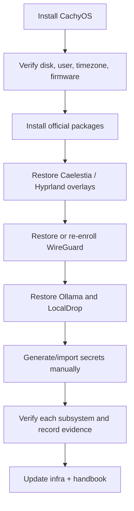

The two repositories can restore the durable configuration layer quickly, but
they cannot recreate private identities, personal data, project source,
wallpapers, browser accounts, LocalDrop's token, or Ollama model blobs. Those
must be restored from separate backups or generated again.

## Recovery sequence

For the planned Windows installation, use the
[2026-09-27 final snapshot and backup checklist](/docs/laptop-msi/final-snapshot).
The Linux rebuild steps below remain available for rollback. The selected NAS
backup covers four directories only and is not a full-machine backup.


```mermaid
flowchart TD
    iso["Install CachyOS"] --> disk["Verify disk, user, timezone, firmware"]
    disk --> packages["Install official packages"]
    packages --> desktop["Restore Caelestia / Hyprland overlays"]
    desktop --> vpn["Restore or re-enroll WireGuard"]
    vpn --> services["Restore Ollama and LocalDrop"]
    services --> secrets["Generate/import secrets manually"]
    secrets --> verify["Verify each subsystem and record evidence"]
    verify --> commit["Update infra + handbook"]
```

## Fast path

1. Install CachyOS and create the `manuel` user.
2. Restore network access and clone both repositories.
3. Follow `zero-five-infra/settings/msi/README.md` for official packages and
   settings.
4. Restore wallpapers and `~/projects/localdrop` from trusted sources.
5. Generate a new SSH key, GPG identity if needed, WireGuard private key, and
   LocalDrop shared token. Never reuse leaked laptop secrets.
6. Verify the desktop, LocalDrop, WireGuard, and Ollama pages in that order.
7. Install only the required Ollama models and record their tags.

The machine-specific monitor outputs, LAN address, and VPN address must be
checked before enabling services. The configuration snapshot assumes the
current `eDP-1`/`DP-1` layout and the planned `10.40.0.12` WireGuard address.

## What requires a separate backup

| Data | Why it is not in Git |
| --- | --- |
| SSH/GPG/WireGuard/Ollama identities | Private credentials and trust relationships |
| LocalDrop `config.toml` | Shared authentication token |
| `~/Pictures/Wallpapers` | Personal media and large files |
| `~/projects/` | Project source and possibly secrets |
| Browser profiles and application accounts | Cookies, certificates, and personal data |
| Ollama models | Large binary blobs; pull by exact tag instead |
| Documents, Downloads, and game data | Personal data |

## Selected settings backup to NAS

On 2026-09-13 the owner narrowed the migration to exactly:

- `/home/manuel/.config` (the whole directory, including application data);
- `/home/manuel/.ssh` (including private keys);
- `/etc/wireguard` (including private configuration);
- `/home/manuel/miniforge3` (the complete installation, base environment and
  environments: `physics`, `projects`, `telegram-translator`, and
  `wildfire-risk-indicator`).

Use the new `scripts/msi-settings-backup.sh` in the infra checkout. Stop the
previous broad backup with Ctrl+C first. The old `msi-nas-backup.sh` is retained
because an instance may still be running; it is superseded for this migration.
Existing broad snapshots are not removed.

```bash
cd ~/Desktop/zero-five/zero-five-infra
bash scripts/msi-settings-backup.sh --plan
systemd-inhibit --what=sleep:idle --why="MSI settings backup" \
  sudo bash scripts/msi-settings-backup.sh
```

Restic must already be installed. Close applications that write settings, keep
AC power connected. Only normal sudo/SSH authentication is needed. The script
uses existing SSH access as `manuel` to create a separate, owner-only encrypted
repository at `delta:/srv/nas/shared/msi-settings-backup/repository`. It checks that the NAS
is mounted and has at least 20 GiB free. JSON progress is displayed during upload.

At the owner's request there is no backup-password prompt. A random recovery key
is generated once at `/srv/nas/shared/msi-settings-backup/password` (mode `600`)
inside an owner-only directory and reused on later runs. Anyone able to read
that directory can decrypt the backup. Preserve the entire directory, including
`password`, when moving it. Earlier password-protected repositories are untouched
and still require their original passwords; the first run at this new path uploads
a fresh copy.

The script backs up only the four directories, with no content exclusions.
Second Brain's project and Docker data are outside this scope, but references
in shared configuration files are not redacted. Symlinks are saved as links;
external targets are not copied. Configuration or credentials outside these
four directories are deliberately not included.

Success requires a completed snapshot, a full repository data check, and an
actual restore/byte comparison of the SSH private key, without displaying it.
Temporary passwords and restored test data are removed from `/run` on exit.
This is a live-file backup; close apps and rerun after final changes. No old
snapshots are pruned. The new workflow is prepared and locally checked; its
NAS snapshot listing was verified on 2026-09-27: snapshot `3f9313b3`, dated
2026-09-13 17:03:56, contains all four roots and reports 20.077 GiB. A full
data check and restore were not repeated during that inspection, so recovery
success remains unverified. See the final snapshot for the additional data
outside this backup's scope.

The Miniforge addition takes effect on the next run. An already-running backup
keeps its original scope. Restore Miniforge to the original
`/home/manuel/miniforge3` path and test each environment on Razer before relying
on it. External project files, editable-install sources outside these roots,
and system libraries are not included in this selected backup.

### Restore later

Save the reported snapshot ID and independent NAS login/VPN
access outside MSI before erasing it. Keys inside the backup alone cannot
provide access to retrieve that backup. The NAS is one physical disk.

On Razer, install restic and establish SSH access to Delta, then run:

```bash
export RESTIC_REPOSITORY=sftp:delta:/srv/nas/shared/msi-settings-backup/repository
export RESTIC_PASSWORD_COMMAND="ssh delta cat /srv/nas/shared/msi-settings-backup/password"
restic snapshots
mkdir -m 700 ~/msi-restore
# Replace SNAPSHOT_ID with the successful ID printed by the backup.
restic restore SNAPSHOT_ID --target ~/msi-restore --verify
```

Restic retrieves the key through SSH without a backup-password prompt. Review the restored settings before
copying them into place; MSI display settings may not suit Razer. Restore SSH
private keys with mode `600` and `.ssh` with mode `700`. Install WireGuard files
as root with restrictive permissions after MSI stops using that identity.
Do not apply the entire MSI `.config` blindly over the Razer desktop.

## Final verification

```bash
hostnamectl
hyprctl monitors
systemctl --user is-enabled localdrop.service
systemctl --user is-active localdrop.service
systemctl is-active wg-quick@wg0
systemctl is-active ollama
ollama list
```

Do not call the rebuild complete until each expected feature has a successful
functional check and the observed machine state is reflected in the infra
snapshot and handbook.
