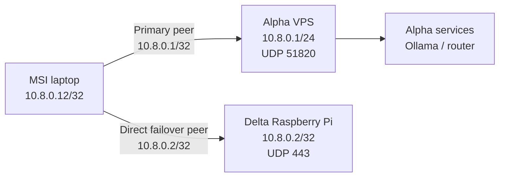

## Design

The MSI is represented by the legacy-named `cachyos-laptop` template in
`zero-five-infra`. Its address is `10.8.0.12/32`. It has two independent
WireGuard peers: Alpha at `10.8.0.1` and Delta at `10.8.0.2`.



The narrow route means ordinary internet, LAN traffic, and local desktop
traffic remain outside WireGuard. The laptop is not a default-route VPN and
does not become a bridge to other clients.

## Current state

The MSI-side reciprocal Delta peer is active. The direct MSI↔Delta handshake,
the `10.8.0.2/32` route, and bidirectional ping were verified on 2026-08-13.
The persistent reboot check remains open.

Delta already contains the MSI public identity and current observed endpoint,
but a WireGuard peer is symmetric: Delta cannot authenticate MSI traffic until
MSI has the Delta peer and MSI's live configuration is reloaded.

The secret-free sources are:

| Source | Purpose |
| --- | --- |
| `zero-five-infra/wireguard/cachyos-laptop.conf.example` | Legacy-named MSI peer template at `10.8.0.12/32`; private key remains a placeholder |
| `zero-five-infra/wireguard/vps.conf.example` | Alpha peer model and `10.8.0.12/32` ownership |
| `zero-five-infra/scripts/validate_wireguard.py` | Local topology and placeholder validation |

Do not rename the template or change the address until the live Alpha peer,
the MSI private key, and the actual machine identity have been checked
together. A peer rename is operational bookkeeping; changing a private key or
address is a connectivity change.

## Inspect safely

```bash
systemctl is-enabled wg-quick@wg0
systemctl is-active wg-quick@wg0
ip -brief address show wg0
ip route get 10.8.0.1
sudo wg show wg0
```

On Alpha:

```bash
ip -brief address show wg0
sudo wg show wg0
ping -c 3 10.8.0.12
```

`wg show` reveals public peer metadata, handshake time, endpoint, and byte
counters, but never paste private-key-bearing output into the handbook.

## Dual-peer activation task

Status: **in progress — reboot persistence remains**.

Complete this task on the MSI laptop's own terminal. Do not paste or commit
the private key.

1. Confirm the MSI public key matches the Alpha registration:

   ```bash
   sudo wg show wg0 public-key
   ```

   It should be the identity represented by the MSI peer in the tracked Alpha
   source. If `wg0` is absent, recover the existing MSI WireGuard profile
   before adding Delta; do not generate a replacement identity casually.

2. Back up the live client configuration and add this peer to the MSI
   configuration:

   ```ini
   [Peer]
   # Peer: delta
   PublicKey = Z/6DvFn45OIUQqngXhdSUJn03WVsaCS1htuJP4PKhw4=
   Endpoint = delta-vpn.zero-five.space:443
   AllowedIPs = 10.8.0.2/32
   PersistentKeepalive = 25
   ```

3. Validate and activate the client. Use the native method already managing
   the MSI profile (`wg-quick` or NetworkManager); do not run both managers:

   ```bash
   sudo wg-quick strip wg0 >/dev/null
   sudo systemctl restart wg-quick@wg0
   sudo wg show wg0
   ```

4. Confirm both paths:

   ```bash
   ping -c 3 10.8.0.1
   ping -c 3 10.8.0.2
   ssh manuel@10.8.0.2
   ```

5. Confirm the Delta peer has a recent handshake. The direct handshake and
   ping are complete; reboot-test the MSI client and repeat both pings before
   marking this task complete.

The Delta peer is a narrow `/32`, so Alpha remains the selected path for Alpha
services and ordinary traffic is unchanged. If Alpha fails, the direct Delta
route remains available for Delta-hosted services and administration.

## Runtime-first activation

If the MSI is not deployed, generate its private key locally and create the
client configuration from the tracked template. Preserve the real file as
root-owned mode `0600`. Add the public key to Alpha at runtime first, test the
handshake and ping, and only then persist the peer in Alpha's root-owned
`/etc/wireguard/wg0.conf`.

The tracked template now contains both the Alpha and Delta peers. Its private
key remains a placeholder because the MSI identity must stay on the laptop.

## Security boundary

- The MSI's peer routes are narrow `/32`s, not `0.0.0.0/0`.
- Delta's direct peer is a backup path, not a replacement for Alpha's service
  routes or firewall policy.
- The Ollama API should bind to `10.8.0.12`, never the public interface.
- The VPS firewall must continue to reject general client-to-client forwarding.
- A WireGuard handshake authenticates the peer; it does not prove that Ollama,
  SSH, or LocalDrop is healthy.

## Rollback

Remove only the Delta peer from the MSI runtime and persistent client file,
then restart only the MSI WireGuard profile. Keep the Alpha peer intact. If the
MSI profile becomes unstartable, restore its pre-change client backup and
restart the profile; do not alter Alpha or Delta while rolling back MSI.
