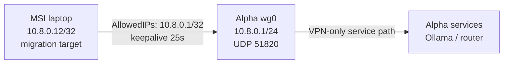

## Design

The MSI is represented by the legacy-named `cachyos-laptop` template in
`zero-five-infra`. Its migration target is `10.8.0.12/32`; Alpha remains
the hub at `10.8.0.1/24`.



The narrow route means ordinary internet, LAN traffic, and local desktop
traffic remain outside WireGuard. The laptop is not a default-route VPN and
does not become a bridge to other clients.

## Current state

WireGuard tools are installed, but the 2026-08-07 unprivileged inventory could
not verify a live `wg0` interface, service enablement, address, handshake, or
LAN address. Treat the tracked peer as a review candidate, not deployed proof.

The secret-free sources are:

| Source | Purpose |
| --- | --- |
| `zero-five-infra/wireguard/cachyos-laptop.conf.example` | Legacy-named MSI peer template at `10.8.0.12/32`; private key remains a placeholder |
| `zero-five-infra/wireguard/vps.conf.example` | Alpha peer model and `10.8.0.12/32` ownership |
| `zero-five-infra/scripts/validate_wireguard.py` | Local topology and placeholder validation |

Do not rename the template or change the address until the live Alpha peer,
the MSI private key, and the actual machine identity have been checked
together. A peer rename is operational bookkeeping; changing a private key or
address is a connectivity change.

## Inspect safely

```bash
systemctl is-enabled wg-quick@wg0
systemctl is-active wg-quick@wg0
ip -brief address show wg0
ip route get 10.8.0.1
sudo wg show wg0
```

On Alpha:

```bash
ip -brief address show wg0
sudo wg show wg0
ping -c 3 10.8.0.12
```

`wg show` reveals public peer metadata, handshake time, endpoint, and byte
counters, but never paste private-key-bearing output into the handbook.

## Runtime-first activation

If the MSI is not deployed, generate its private key locally and create the
client configuration from the tracked template. Preserve the real file as
root-owned mode `0600`. Add the public key to Alpha at runtime first, test the
handshake and ping, and only then persist the peer in Alpha's root-owned
`/etc/wireguard/wg0.conf`.

The exact deployment commands depend on the live private key and Alpha state,
so they are intentionally not hard-coded here. Use the existing VPS
WireGuard runbook and keep a working SSH path open during the change.

## Security boundary

- The MSI's intended route is Alpha-only, not `0.0.0.0/0`.
- The Ollama API should bind to `10.8.0.12`, never the public interface.
- The VPS firewall must continue to reject general client-to-client forwarding.
- A WireGuard handshake authenticates the peer; it does not prove that Ollama,
  SSH, or LocalDrop is healthy.

## Rollback

Remove only the MSI public peer from Alpha's runtime state, disable only the
MSI's `wg-quick@wg0` service, and restore the Alpha backup if persistence was
edited. Do not restart or remove Beta, Gamma, MacBook, or iPhone peers during
this rollback.
