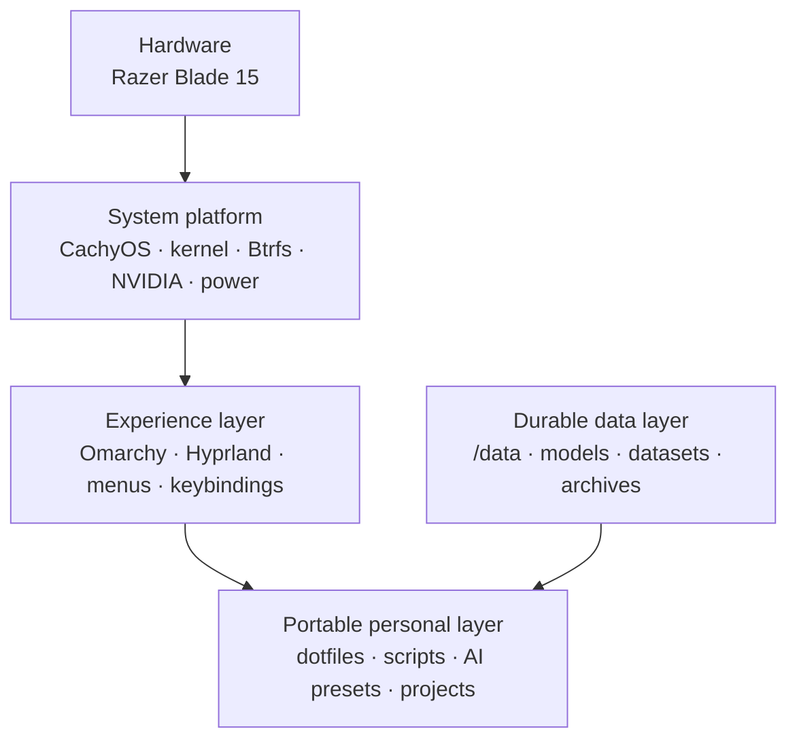

> **Status: proposed.** The laptop has been purchased but has not been inventoried,
> partitioned, or enrolled in Zero Five. Hardware details, operating system state,
> disk topology, power measurements, and network identity below are design targets,
> not verified configuration.
>
> The retirement order is intentionally sequential: prepare and independently
> verify the NAS migration archive while the MSI and MacBook are available, sell
> them after the pre-sale acceptance gate, then configure this Razer from the
> archive and Git. See [Sequential MSI and MacBook retirement migration](/docs/laptop-razer/migration).

The intended role is a portable Linux workstation for university work, development,
and local AI. It should remain recoverable when a distribution, desktop layer, SSD,
or the laptop itself is replaced.

## Proposed identity

| Property | Target |
| --- | --- |
| Handbook identity | `laptop-razer` |
| Hardware | Razer Blade 15; Intel Core i7-12800H; RTX 3080 Ti 16 GB; 32 GB RAM |
| Initial OS layout | Existing Windows 11 plus CachyOS Linux |
| Linux experience layer | Omarchy compatibility layer on CachyOS, stable channel |
| Filesystem | Btrfs with Snapper snapshots |
| Mesh identity | Not assigned; do not reserve a WireGuard address until the device is installed and tested |
| Present relationship to MSI/MacBook | They remain active documented devices; any archival is future work after migration and verification |

## Layered design



CachyOS owns hardware enablement: bootloader, kernel, NVIDIA/PRIME, CPU
scheduling, Btrfs, Snapper, power management, and CUDA. Omarchy owns the user
experience. Personal customizations belong under user configuration paths and a
version-controlled dotfiles repository, rather than Omarchy package-owned paths.
The durable layer must never include credentials, private keys, tokens, wallet
seeds, or certificates.

## Storage plan

The initial 1 TB SSD should retain Windows recovery and Windows 11 while leaving
room for CachyOS and an unallocated recovery margin. The exact sizes must be
decided only after inspecting the shipped partition table and Windows recovery
requirements; the working target is roughly 320 GB Windows, 580 GB CachyOS, and
50 GB unallocated.

Use one CachyOS Btrfs filesystem with subvolumes rather than fixed partitions
for `/home` and `/var`:

```text
CachyOS Btrfs
├── @              /
├── @home          /home
├── @snapshots     /.snapshots
├── @cache
└── @log
```

A future 2 TB second SSD is intended for portable data at `/data`:

```text
/data
├── ai/{models,cache,agents,benchmarks,configs}
├── projects
├── datasets
├── containers
├── games
├── university
└── archives
```

Model and cache locations should be configured explicitly (for example
`HF_HOME` and `OLLAMA_MODELS`) so an OS reinstall does not require re-downloading
the AI estate.

## Operating profiles

Three user-selected profiles are proposed; their actual power draw and battery
life must be measured on this hardware before being treated as targets.

| Profile | Intent |
| --- | --- |
| Extreme Battery | Intel iGPU only, RTX asleep, 60 Hz, reduced brightness and CPU boost, keyboard RGB off; target light-use envelope 8–12 W |
| Balanced | Intel desktop, normal CPU boost, 120/240 Hz where appropriate, RTX available through PRIME |
| AI / Gaming | AC power, RTX at performance power limit, 240 Hz, CUDA and high-performance CPU policy |

The intended shortcuts are `Super+Shift+B` (battery), `Super+Shift+N` (normal),
and `Super+Shift+P` (performance). They are not implemented yet.

## Rebuild and update model

The personal layer should be installable from a secret-free dotfiles repository,
for example `github.com/Manuel0516/dotfiles`. It may include Hyprland overlays,
Omarchy extensions/hooks, shell/editor settings, package manifests, AI presets,
and scripts. Secrets remain in a password manager, `~/.ssh`, or separately
encrypted backup.

Before substantial CachyOS or Omarchy updates:

1. Create and verify a Snapper snapshot.
2. Check the dotfiles working tree is committed or intentionally clean.
3. Update the system and reboot.
4. Test Hyprland, Wi-Fi, suspend, iGPU, NVIDIA/PRIME, CUDA, and the selected
   power profile.
5. Roll back with Snapper if a verified regression blocks normal use.

## Installation order

1. Verify shipped Windows, firmware, display, keyboard, battery, thermals, and
   storage health.
2. Record an inventory without publishing serial numbers or secret-bearing output.
3. Repartition conservatively; install CachyOS with Btrfs and Snapper.
4. Verify NVIDIA hybrid graphics, PRIME, suspend, power controls, and CUDA.
5. Take a known-good snapshot.
6. Install the Omarchy compatibility layer and personal dotfiles.
7. Implement and measure the three power profiles.
8. Add AI tooling and canonical `/data/ai` paths.
9. Only then design Zero Five network enrollment, SSH, and WireGuard access.

## First inventory

Run these locally after delivery, retaining private identifiers outside the
handbook:

```bash
hostnamectl
cat /etc/os-release
lscpu
lspci -nnk | grep -A3 -E 'VGA|3D|Display'
lsblk -o NAME,SIZE,MODEL,TYPE,FSTYPE,MOUNTPOINTS
free -h
upower -e
```

Do not retire the MSI or MacBook until the NAS archive has passed the
**pre-sale** manifest and restore acceptance gate in the
[sequential migration runbook](/docs/laptop-razer/migration). The Razer is then
configured after sale from that retained archive, Git and newly enrolled
identities.
