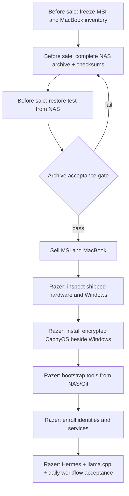

## Current status — 2026-10-04

The MSI has been sold and cannot be contacted. The MacBook remains available.
The Razer is already installed with Omarchy 4.0.4. The older sequential plan
below is retained as historical planning; its source-device availability and
CachyOS installation assumptions no longer describe this migration.

The owner supplied `smb://192.168.1.106/shared/` as the archive access path.
Local AI and personalization are already configured according to the owner;
current work focuses on development, university tooling and LocalDrop.
The live continuation installed and tested development/scientific/LaTeX tools,
verified English/Spanish switching and WireGuard access, repaired runtime Delta
DNS selection and recovered the LocalDrop token privately. See
[verified results and pairing blockers](/docs/laptop-razer/development).

### Recover MSI from retained evidence

The [final MSI snapshot](/docs/laptop-msi/final-snapshot) records a verified
Delta archive at `/srv/nas/shared/msi-settings-backup/repository`:
settings baseline `3f9313b3`, selected projects `56856c59`, and final shell,
credentials and AI-history extras `ca3975bb`. Personal files are separately
recorded at `/srv/nas/shared/msi-personal-review-2026-09-27`.
These are historical full-backup verification records. The continuation confirmed
repository access and recovered the LocalDrop configuration from `56856c59`;
it did not repeat a complete archive integrity check.

Restore selected material into a separate private staging directory and compare
its manifests before applying configuration. Use the existing encrypted recovery
procedure privately; never commit extracted credentials or paste passwords into
agent logs. Razer now owns the former laptop addresses and roles; retain any restored
private material outside Git. Current public identity matches the inherited
peer. Identity rotation/retirement is a separate check. Review MSI's AMD,
CachyOS and Caelestia settings before translating them to NVIDIA and Omarchy.
The earlier archive selection excluded Bonsai and FreeCAD. This is not an
instruction to remove Razer's already installed Bonsai AI, which is now preserved
in the [current AI record](/docs/laptop-razer/ai).

### Export the available MacBook

Capture current package and editor manifests, project remotes, unpushed work,
scientific environment specifications and unique personal files while it remains
available. The existing [MacBook handbook](/docs/macbook) records Ghostty,
Zsh/Starship, VS Code extensions, Miniforge physics tools, LaTeX, Docker/Colima,
AI coding tools, llama.cpp and LocalDrop. Port workflows to Linux; review
platform-specific settings before restoring them.

### Build and verify the Razer

1. Complete the [observed baseline](/docs/laptop-razer/inventory), including existing GPU/power helpers and live checks.
2. Confirm the owner's preferred tools, appearance, monitors and first priorities.
3. Restore selected projects and data; rebuild environments from specifications and lockfiles.
4. Configure and test private access with a fresh Razer identity.
5. Personalize the desktop, terminal and editors with reviewed user overlays.
6. Verify local AI and selected power profiles on the actual GPU.
7. Create a tested backup and complete the MacBook replacement acceptance checks.

Source configurations exclusive to the retired hardware remain under
`zero-five-infra/archive/msi/`. The owner transferred the laptop's current
addresses, network/service roles and active labels to Razer. The shared models
now use `razer`, with active client source `wireguard/razer.conf.example`.
The live Razer uses `.12` and the inherited public identity. The inherited LAN
reservation `.110`, canonical DNS rewrite and remote service acceptance remain
explicitly tracked on [Razer networking](/docs/laptop-razer/network).

Historical NAS directory names and snapshot IDs stay valid; relabeling active
ownership does not rename or invalidate those archives. The reviewed current
personal layer and new tooling are included in
[the Razer pack](/docs/laptop-razer/configuration-pack).

## Historical sequential plan

## Decision

This is **not** a live device-to-device migration. The MSI and MacBook will be
prepared first, their approved data and reproducible configuration will be
made available from the NAS, and they will then be sold. Only after that will
the Razer be configured.

The Razer therefore must be rebuildable from three sources that remain after
the sale:

1. the verified NAS migration archive;
2. public/private Git repositories and their documented revisions; and
3. newly enrolled identities and secrets, created or restored through approved
   secret-management paths.

The source laptops are not available during Razer setup. No step on the Razer
may assume it can SSH to, copy from, or compare against the MSI or MacBook.

## Boundary and security model

- The NAS is the current migration archive, not automatically a proven
  disaster-recovery system. The storage and backup controller is Delta at
  `/srv/nas`; its general backup design is documented at
  [Delta backup controller](/docs/raspberry/backup).
- A NAS file being present is not enough. Before sale, record its path, size,
  checksum manifest, permissions, encryption state, and an actual restore test.
- Do **not** put passwords, OAuth/browser sessions, Telegram credentials,
  private SSH/GPG/WireGuard keys, API keys, wallet material, seed phrases, or
  secret `.env` files into the general migration archive or handbook.
- Use fresh Razer-specific SSH and WireGuard identities. Re-enroll provider and
  browser accounts on the Razer instead of bulk-copying auth stores.
- Existing remote Zero Five services remain where they are. The Razer becomes a
  private administration client; it does not replace the VPS, Delta, Beta or
  Gamma.
- LP tooling remains read-only. The Razer must never receive a wallet secret or
  automatic blockchain-mutation path.

## Final state

The intended final workstation is the documented
[Razer Blade 15](/docs/laptop-razer): Windows retained for Windows-only tasks;
CachyOS Linux as the daily development environment; Btrfs snapshots; NVIDIA
CUDA/PRIME after hardware validation; and a recoverable personal layer.

Linux must contain, after the post-sale build and acceptance test:

- Hermes Agent as a normal user installation, with credentials enrolled on the
  Razer and no duplicate Telegram gateway enabled by accident;
- llama.cpp compiled for the actual Razer GPU/CPU backend, model files stored
  under an explicit local data path, and a loopback-only server;
- Git/GitHub SSH, Python + `uv`, Node.js, Docker/Compose, C/C++ build tooling,
  CMake/Ninja, LaTeX/PDF tools, Jupyter/scientific Python, terminal/shell and
  the selected editor;
- approved project repositories under `~/services`, recreated from remotes and
  lockfiles rather than opaque copied environments;
- VPN and SSH access through the established private Zero Five route; and
- backup, snapshots, restore instructions and a tool manifest that make a
  future replacement possible without either retired laptop.

## Sequential runbook

### Stage 1 — before the sale: freeze the portable environment

Perform this while both source laptops are still available. Do not start Razer
installation in this stage.

1. **Freeze change-sensitive work.** Push approved commits; record unpushed
   branches, stashes and local-only repositories; stop or document local
   development servers; export school/career material in its native form and
   PDF where applicable.
2. **Build an explicit migration manifest on the NAS.** For every item, record
   source device, original path, NAS archive path, classification, byte size,
   SHA-256 hash, restore target and disposition (`restore`, `re-clone`,
   `re-download`, `re-enroll`, or `do not migrate`). Never use “copy the whole
   home directory” as a migration operation.
3. **Archive irreproducible personal data.** This includes approved documents,
   university material, CV/application files, photos/media, personal exports,
   local repositories with work not present upstream, and any intentional local
   application data. Preserve permissions/metadata for Linux repository data.
4. **Create reproducible developer manifests.** Capture, review and archive:
   - MSI package and desktop manifests already represented by
     `zero-five-infra/archive/msi/settings/msi/` and the MSI handbook pages;
   - Mac Homebrew, editor, terminal, Python, Docker, LaTeX and AI-tool
     manifests referenced by the [MacBook handbook](/docs/macbook);
   - the final selected daily-tool list for the Razer, removing one-off,
     obsolete and OS-specific packages;
   - project lockfiles, build commands, test commands and canonical remotes.
5. **Make Hermes portable without copying secrets.** Archive a secret-free list
   of required skills, scripts, cron definitions, configuration choices,
   provider names and workflow notes. Exclude `auth.json`, Telegram tokens,
   browser sessions, `.env` values and generated credentials. Any job that
   belongs on the always-on homelab remains there.
6. **Make local AI portable without copying unnecessary blobs.** Archive the
   llama.cpp source revision/build notes, model repository, exact GGUF filename,
   quantization, context settings and benchmark notes. Copy a model to the NAS
   only if the time/bandwidth savings justify it and storage capacity is
   confirmed; otherwise store a verified download manifest and re-download on
   the Razer.
7. **Prepare access after sale.** Confirm how a freshly installed Razer will
   access the NAS before VPN and SSH are set up. Preferred choices are a
   LAN-only NAS share with a newly issued temporary migration credential, or an
   encrypted external copy made from the NAS. Do not depend on a source-laptop
   WireGuard key. Record access instructions without the password.
8. **Export recovery material.** Create current Linux/Windows installer USBs,
   verify vendor checksums, and keep a safe out-of-band record of the recovery
   keys/passphrases needed for the new Razer design. This does not mean copying
   source-laptop private keys.

### Stage 2 — before the sale: verify the NAS archive

This stage is the blocking gate. It must finish while the source devices can
still correct omissions.

1. Verify the NAS mount is actually Delta’s intended `/srv/nas`, has sufficient
   free space and uses expected permissions for the migration archive.
2. Compare the archive manifest with the source inventories: item counts, bytes
   and hashes must match for every high-value item.
3. Perform a **restore rehearsal** from the NAS to a temporary destination that
   is not the source path. Open representative documents, run `git fsck` and
   `git status` on restored repositories, and compile one known LaTeX/PDF
   artifact if one is included.
4. Confirm that every needed Razer bootstrap component is available without a
   source laptop: installer media, NAS access method, Git remotes, package/tool
   manifest, dotfiles/configuration bundle and the secret re-enrollment list.
5. Produce `migration-acceptance-before-sale.md` containing pass/fail evidence,
   omissions, total archived bytes and the exact NAS path. Do not sell a device
   while any item remains `unknown` or only one untested copy exists.

**Gate A — approval to sell:** the NAS archive has passed the restore rehearsal,
all required material can be retrieved without MSI/MacBook access, and the user
has reviewed the final manifest.

### Stage 3 — MSI conversion to a clean Windows sale image

This stage is performed **only after Gate A** and before selling the MSI. It
intentionally removes the MSI Linux installation. Do not begin until the NAS
restore rehearsal proves that all material needed later on the Razer is
retrievable without the MSI.

1. **Retire MSI roles before wiping.** Remove the historical MSI Ollama provider
   from Open WebUI/router configuration, disable local user services, revoke its
   WireGuard peer only when replacement access is ready, and remove its browser
   sessions from account-device lists. Do not leave a dead host recorded as a
   live AI backend.
2. **Prepare verified Windows media.** Download the current Windows 11 ISO from
   Microsoft, verify the vendor checksum/signature where supplied, and create a
   bootable USB. Retain a second recovery USB until the buyer has collected the
   device. Preserve the MSI Windows licence/firmware activation; do not publish
   product keys or serial numbers.
3. **Erase Linux deliberately in Windows Setup.** Boot the installer in UEFI
   mode, confirm the internal disk by model and capacity, then delete **only**
   the MSI internal-drive Linux partitions. For a sale-ready clean install, it
   is normally safest to delete all partitions on that confirmed internal MSI
   drive and let Windows Setup recreate EFI/MSR/Recovery/NTFS partitions. Never
   touch the NAS, migration disk, installer USB or any external drive.
4. **Install using a local, temporary setup account if a test account is
   required.** Disconnect network during OOBE and choose the installer’s local/
   offline account path when the installed Windows edition exposes it. Windows
   11 Pro/Education commonly exposes a local/domain-join route; Home and
   release-specific OOBE screens can differ. Do not sign in with Manuel’s
   Microsoft, work, school, browser or password-manager account. If the chosen
   edition cannot create a local account offline, stop and use an approved
   local-account-capable edition/installer workflow rather than attaching a
   personal Microsoft account.
5. **Validate the fresh installation with no personal data.** Once at the local
   temporary desktop, install only Windows Update and MSI/Razer-independent
   hardware drivers needed to confirm Wi-Fi, display, keyboard, audio, camera,
   storage and battery. Do not install Hermes, developer repositories, VPN,
   browser sync, personal files, games or licensed personal applications.
6. **Return the MSI to first-boot OOBE with no user account.** From the temporary
   local administrator session, run Windows Sysprep with `OOBE`, `Generalize`
   and `Shutdown` selected. This removes the temporary account from the buyer
   experience and powers off at the normal first-boot setup screen. Do not boot
   it again after Sysprep; the buyer must be the next person to complete OOBE.
7. **Sale handover check.** Power on only far enough to verify the Windows OOBE
   region/keyboard welcome screen appears, then power off. Confirm there are no
   personal accounts, user files, Linux boot entries, remote-service identities
   or private network credentials remaining. Keep sale receipts and serial
   numbers outside the public handbook.

### Stage 4 — sell both source devices and preserve the archive

1. Sell the MSI only after the clean Windows OOBE handover check passes. Sell
   the MacBook after its separate approved factory-reset/account-removal check.
2. Do not delete the NAS archive at sale time. Keep it read-only/immutable where
   feasible until the Razer has passed the full acceptance stage.
3. Keep the migration manifest, Windows media provenance and sale records in the
   retained private migration evidence, not in a public repository.

### Stage 5 — after the sale: establish the Razer platform

Follow this stage only with the NAS/Git bootstrap kit; no source-machine
assistance is expected.

1. Inspect the shipped Razer hardware and existing Windows partition layout.
   Validate display, keyboard, battery, storage, firmware and Windows recovery
   before partitioning. The intended Razer hardware/design is documented on the
   [Razer overview](/docs/laptop-razer), but live facts override targets.
2. Preserve Windows 11, install CachyOS in UEFI/GPT mode alongside it, and use
   LUKS2-encrypted Btrfs with snapshots. Choose final capacity only after live
   disk inspection; preserve Windows recovery partitions and leave a recovery
   margin. Disable Windows Fast Startup before mounting Windows filesystems from
   Linux.
3. Verify repeated Linux ↔ Windows booting, Wi-Fi, audio, webcam, external
   display, sleep/resume, NVIDIA/PRIME and CUDA before loading the personal
   environment. Take a known-good snapshot.
4. Access the NAS via the pre-approved bootstrap route. Restore only the files
   marked `restore`; clone repositories marked `re-clone`; download models
   marked `re-download`; and perform each `re-enroll` step interactively.
5. Install the reviewed developer baseline: Git, SSH, Python/uv, Node/corepack,
   Docker/Compose, build tools, CMake/Ninja, LaTeX/PDF tools, Jupyter, selected
   editor/terminal and project dependencies from lockfiles. Run each project’s
   documented tests.
6. Install Hermes using the official current method. Run `hermes doctor`,
   authenticate anew, migrate only reviewed secret-free skills/configuration,
   and verify local interactive operation before any Telegram integration. The
   existing homelab gateway remains authoritative unless an explicit routing
   change is approved.
7. Build llama.cpp for the detected RTX 3080 Ti/CUDA path only after the driver
   is verified. Validate `llama-cli`, then a loopback-only `llama-server`, with
   the manifest-selected GGUF. Record build flags, model hash, GPU layers,
   context size and a small benchmark.
8. Re-enroll Razer-specific SSH and WireGuard identities using the established
   Delta → Beta → target access approach. Verify private routes; do not create
   public DNS records or copy source VPN keys.

### Stage 6 — post-sale assembled acceptance and archive closure

The Razer is not complete until this sequence works in one session:

1. cold boot Linux and unlock storage;
2. connect Wi-Fi and VPN, then use the private homelab administration route;
3. clone/open a project, run its build/tests and confirm clean Git status;
4. build a LaTeX/PDF document and run a scientific Python/Jupyter example;
5. start and stop a non-production Docker Compose workload;
6. use Hermes for a safe local tool operation; test Telegram only if intentionally
   enabled and routed correctly;
7. run llama.cpp locally and verify its loopback API;
8. suspend/resume and test an external monitor; and
9. boot Windows and validate the required Windows-only workflow, then return to
   Linux.

Finally, restore a file and a repository from the NAS into a disposable path,
verify their hashes/status, update the Razer handbook with observed state, and
only then convert the NAS migration archive from active bootstrap material to
longer-term retained backup/archive.

## Failure modes and rollback

| Failure | Safe response |
| --- | --- |
| NAS archive cannot be mounted/read | Do not sell sources; repair NAS access and repeat checksum/restore validation. |
| Archive item is missing or corrupt | Re-export it while its source laptop remains available; update manifest and repeat Gate A. |
| Razer Linux installation breaks Windows boot | Use Windows recovery media and the retained installer/recovery records; do not write over data partitions. |
| Razer driver, suspend or NVIDIA failure | Roll back to the baseline snapshot and resolve using the live-hardware record before importing the full environment. |
| Hermes cannot authenticate or routes incorrectly | Keep it local; re-authenticate and inspect profile/routing configuration. Do not copy old auth stores. |
| Local model consumes too much disk/RAM/VRAM | Remove the model, use the manifest to choose a smaller quant, and keep the server loopback-only. |

## Evidence required

- NAS archive path, free-space check, manifest and SHA-256 results;
- completed restore-rehearsal log before sale;
- final pre-sale inventory showing no unresolved source-only data;
- Razer before/after partition map and OS recovery readiness;
- hardware validation and baseline snapshot evidence;
- Hermes health and functional test record without credentials;
- llama.cpp build/benchmark/API record;
- project build/test results and full assembled acceptance log; and
- final restore test from the retained NAS archive.
