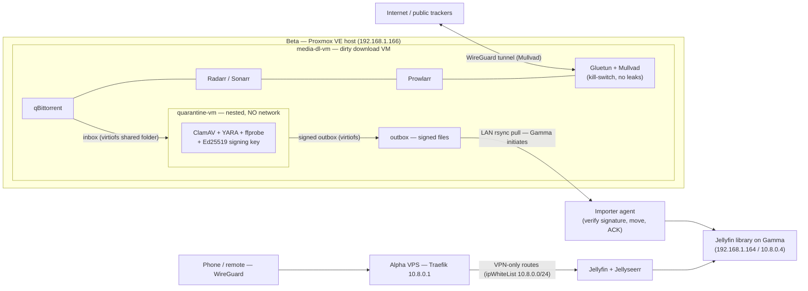

> **Status: DESIGN PROPOSAL — nothing in this page is deployed.**
> This document records the agreed architecture and requirements. It will be
> updated as components are built, and a separate runbook/configuration page
> will document verified state.

## Goal and threat model

A fully automated Jellyfin stack (Jellyseerr → Radarr/Sonarr → qBittorrent →
quarantine → Jellyfin) split across two machines with a strict trust boundary:

- **Gamma** (laptop-gamma) is the *clean* box: Jellyfin, Jellyseerr, and the
  importer agent. It must stay **100% clean, always**: zero internet egress,
  zero untrusted file processing, and the only files that enter its library
  are cryptographically signed by the quarantine VM.
- **Beta** (laptop-beta, the Proxmox host) runs a **download VM** with the
  whole dirty process (Gluetun + Mullvad, qBittorrent, Prowlarr, Radarr,
  Sonarr) and, *nested inside that VM*, an air-gapped **quarantine VM**.
- **Public trackers only.** Private trackers are rejected by design: they
  require accounts (a linkable identity). Public trackers have no accounts;
  their higher malware risk is exactly what the quarantine VM exists for.
- **Anonymity of downloads:** Mullvad with a **separate, dedicated account**
  used only on the download VM, paid anonymously (cash/crypto — the payment
  trail is the leak vector, not the account number).
- **Seed only while downloading, never after.** Seeding stops at ratio 0.05;
  the file is deleted from Beta only after Gamma confirms it is safely in the
  library (ACK ordering below).
- **One-way network:** the download VM never initiates anything toward Gamma,
  Alpha, or the WireGuard mesh. Gamma initiates every cross-box connection.
- **Destroy on detection:** any malware hit inside the quarantine VM, or any
  signature failure on Gamma, destroys the offending file **and** rebuilds the
  quarantine VM from a pristine template with a rotated signing key.

Other future VMs on Beta (e.g. a pentest box) are **out of scope** for this
design.

## Naming map

| Name | What it is |
| --- | --- |
| Beta | HP 15 Proxmox VE host (192.168.1.166, wg0 10.8.0.5). See [Proxmox baseline](/docs/laptop-beta/proxmox). |
| `media-dl-vm` | Dirty download VM running on Beta. Hosts Gluetun+Mullvad, qBittorrent, Prowlarr, Radarr, Sonarr, and the nested quarantine VM. |
| `quarantine-vm` | Hermetic scan VM, **nested inside `media-dl-vm`**. No network interfaces at all; files in/out only via shared folders. Holds the signing key. |
| Gamma | Clean box (192.168.1.164, wg0 10.8.0.4). Jellyfin + Jellyseerr + importer agent. See [WireGuard](/docs/laptop-gamma/wireguard). |
| Alpha | VPS WireGuard hub + Traefik (10.8.0.1). Provides VPN-only remote access to Jellyfin/Jellyseerr on Gamma. |

## Topology



## Components

| Component | Where | Role |
| --- | --- | --- |
| Gluetun + Mullvad | `media-dl-vm` | VPN client with hard kill-switch; IPv6 disabled; DNS forced through tunnel. Separate anonymous Mullvad account. |
| qBittorrent | `media-dl-vm` | Torrent client, bound to Gluetun's network namespace. Seeding limit: stop at ratio 0.05. WebUI LAN-only. |
| Prowlarr | `media-dl-vm` | All indexer traffic (public trackers), through the VPN. |
| Radarr / Sonarr | `media-dl-vm` | Decide what to grab; send magnets to qBittorrent. Never touch Gamma. |
| quarantine-vm | nested in `media-dl-vm` | ClamAV + YARA + ffprobe structural validation + sandboxed decode attempt. Signs passing files. Air-gapped, snapshotted, disposable. |
| Importer agent | Gamma | Pulls signed files over LAN, verifies Ed25519 signature + manifest hashes, moves into library, notifies the arrs via API, sends ACK back. The **only** writer into the library. |
| Jellyfin + Jellyseerr | Gamma | Serve content to users; receive pipeline alerts as in-app notifications. |
| Cleanup daemon | `media-dl-vm` | On ACK: deletes outbox copy + qBittorrent torrent entry and leftover data. |

## Pipeline flow

```
1. Request (Jellyseerr) → Radarr/Sonarr grab via Prowlarr → qBittorrent
2. Torrent completes → seeding stops (ratio 0.05 limit)
3. Completed files moved into quarantine-vm inbox (shared folder)
4. quarantine-vm (no network): ClamAV + YARA + ffprobe + sandboxed decode
   - PASS → manifest (SHA-256 + verdict) signed with Ed25519 key
     → files + manifest to outbox
   - FAIL → Destruction protocol A
5. Gamma importer agent (inotify/timer) pulls outbox via LAN rsync
   → verifies signature and hashes
   → FAIL → Destruction protocol B
   → PASS → move into library with arr naming, notify arr API, send ACK
6. Cleanup daemon on media-dl-vm receives ACK → deletes outbox copy,
   qBittorrent torrent entry and leftover data
7. Jellyfin library refreshes (arr notification); user streams
```

**ACK ordering is the data-loss guarantee:** the file on Beta is deleted only
after Gamma has verified and placed it. There is no window where the file is
gone from both sides.

## Signature scheme and key lifecycle

- The quarantine VM signs a **manifest** per release bundle: `{file → SHA-256,
  scan verdict, tool versions, timestamp}`. Multi-file releases (mkv + srt +
  jpg) are covered as one signed bundle.
- **Ed25519.** The private key never leaves the quarantine VM; it lives on a
  small persistent key disk that survives VM rebuilds. Gamma holds only the
  public verify key.
- Gamma rejects any file whose signature or hash does not verify — nothing
  enters the library unsigned.
- **Rotation rule:** any incident (scan hit or signature failure) means the key
  is treated as burned. The rebuild protocol generates a fresh keypair and
  registers the new public key on Gamma automatically.

## Destruction protocol

Both triggers follow the same scorched-earth response:

1. **Delete the offending artifacts** (malicious file in the quarantine VM and
   any outbox remnants; or the unverified file on Gamma).
2. **Destroy `quarantine-vm`** and rebuild from a pristine template (fresh
   boot, clean scan toolchain).
3. **Rotate the signing key** (new keypair; Gamma's public key updated).
4. **Alert** inside Jellyfin's in-app notifications.

| Trigger | Detected where | Actions |
| --- | --- | --- |
| **A — malware / scan failure** | inside quarantine-vm | Delete file(s), destroy + rebuild quarantine-vm, rotate key, alert. |
| **B — signature verification failure** | on Gamma | Delete the unverified file locally, send the **destruction command** to `media-dl-vm` (restricted SSH key limited to the rebuild script, or a LAN-only authenticated endpoint), then same rebuild + rotation + alert. |

A signature failure is treated as tampering with the pipeline itself, which is
why it escalates to a full rebuild even though Gamma has no malware — the
integrity chain is broken and must be re-established.

## Network rules

| Component | Egress | Inbound (LAN only) | Never |
| --- | --- | --- | --- |
| `media-dl-vm` | Mullvad tunnel only | SSH (pull), arr/qBittorrent WebUIs, ACK endpoint | WireGuard mesh, Alpha, Gamma-initiated connections out |
| `quarantine-vm` | **none** (no NICs) | none (shared folders only) | anything network |
| Beta host | as per [baseline](/docs/laptop-beta/proxmox) | LAN admin + Alpha ProxyJump (wg0 10.8.0.5) | — |
| Gamma | **none** (default-deny outbound) | mesh (10.8.0.4) + LAN | internet |
| Alpha | — | Traefik VPN-only routes | public exposure of Jellyfin/Jellyseerr |

UFW on `media-dl-vm`: default deny; allow the LAN ports above plus the Mullvad
interface only. The download VM gets **no 10.8.0.x address** — it is an island
that can only crawl out through its own Mullvad tunnel and serve signed files
to Gamma.

## Remote access

Same VPN-only pattern as the handbook services:

- DNS: `jellyfin.zero-five.space` and `jellyseerr.zero-five.space` → `10.8.0.1`,
  grey cloud (proxied=false).
- Alpha Traefik: file-provider routes with `ipWhiteList: 10.8.0.0/24`
  middleware, forwarding to Gamma at `10.8.0.4`.
- Phone/remote: WireGuard client → Alpha → Traefik → Gamma. At home the phone
  can hit Gamma's LAN IP directly.

## Prerequisites on Beta (from its own baseline)

1. **SMT / L1TF decision before deploying.** Beta's Haswell CPU is L1TF-affected
   with SMT vulnerable. The quarantine VM is precisely the "untrusted guest"
   case the [Proxmox baseline](/docs/laptop-beta/proxmox) flags — disable SMT
   in firmware first (its own next-step #1).
2. **Enable Proxmox firewall policy** before workloads run (baseline #3).
3. **Create a backup target** for VM templates/configs before the first VM
   (baseline #4).
4. **Nested virtualization:** enable nested KVM on Beta
   (`kvm_intel nested=1`) so `media-dl-vm` can host `quarantine-vm`.
5. **Full-disk encryption on both laptops** (Beta and Gamma). Laptops get
   stolen; the Mullvad account key and download logs on Beta are the anonymity
   link and must be protected at rest.

## Automation inventory (to be built)

| Piece | Where | Trigger |
| --- | --- | --- |
| Inbox/outbox watchers | `media-dl-vm` | inotify on completion/shared folders |
| Scan pipeline | quarantine-vm | new inbox file |
| Signing daemon | quarantine-vm | scan PASS |
| Importer agent (systemd) | Gamma | inotify/timer on pulled outbox |
| Cleanup daemon | `media-dl-vm` | ACK from Gamma |
| Rebuild + key rotation script | `media-dl-vm` | destruction command |
| Alerts → Jellyfin notifications | pipeline scripts | incident / import events |

## Trade-offs and open questions

- **Nested virtualization on a Haswell laptop:** performance overhead plus the
  L1TF/SMT consideration above. The inner VM's snapshots live inside
  `media-dl-vm`'s disk — full `media-dl-vm` rebuild is the escalation path,
  with arr config on a persistent disk so history survives.
- **Arr history cosmetics:** because the importer agent (not the arrs) moves
  files, arr history may show downloads as "removed/imported elsewhere". A
  read-only view of the library on `media-dl-vm` can give clean history; decide
  at build time.
- **Mullvad has no port forwarding** — irrelevant here: no private trackers, no
  post-download seeding by design.
- **Exact arr API wiring** (rescan vs. manual import) and the restricted SSH
  pull setup to be validated during build.
- **Verdict signing trust:** an exploited quarantine VM could in principle sign
  a malicious file before detection. Mitigations: air-gap, non-root scan
  process, and key rotation on every incident — a burned key is useless.

## Next steps

1. Lock Beta prerequisites (SMT, firewall, backup target, nested virt, FDE).
2. Build `media-dl-vm` template; deploy Gluetun/Mullvad + qBittorrent + arr
   stack; verify leak-freedom (ipleak.net from inside the container).
3. Build `quarantine-vm` with the scan/sign pipeline.
4. Build the Gamma importer agent + ACK/cleanup loop.
5. Alpha Traefik routes for jellyfin/jellyseerr.
6. This page moves from proposal to verified state as each step lands.
