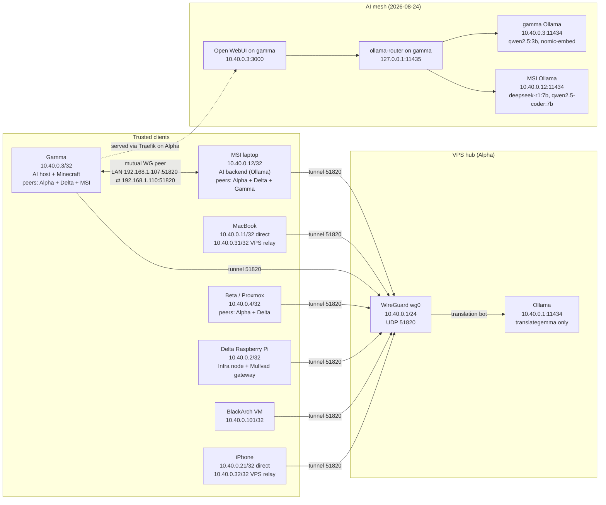

WireGuard creates Zero Five's private `10.40.0.0/24` network. The VPS is the
stable public hub and primary path. Delta is now a second infrastructure node
with a public UDP endpoint and direct peer definitions for registered clients.
Gamma and the iPhone also connect as deployed clients.
Beta is registered as a deployed client.
Delta is deployed as the infrastructure peer at `10.40.0.2/32`. Its direct
roaming endpoint is configured separately from the optional Alpha relay
fallback. The BlackArch VM on Beta is registered as a direct VM client at
`10.40.0.101/32`.
Ollama traffic can therefore cross the internet inside an encrypted tunnel
without exposing the Ollama API publicly.

## Current state



| Machine | Address | Role | Peers |
| --- | --- | --- | --- |
| Alpha VPS | `10.40.0.1/24` | WireGuard hub, Traefik edge, translation bot | all clients |
| Delta Pi | `10.40.0.2/32` | Infra node: AdGuard DNS, app gateway, backup controller, Mullvad gateway | Alpha + registered clients |
| Gamma | `10.40.0.3/32` | AI host (Open WebUI, ollama-router, SearXNG, Ollama qwen2.5:3b/nomic-embed-text), Minecraft | Alpha + Delta + **MSI** |
| Beta / Proxmox | `10.40.0.4/32` | Proxmox VE host, BlackArch VM parent | Alpha + Delta |
| MacBook | `10.40.0.11/32` direct; `10.40.0.31/32` VPS relay | Admin + dev box | Alpha + Delta |
| MSI | `10.40.0.12/32` | **AI backend** (Ollama deepseek-r1:7b, qwen2.5-coder:7b), personal desktop | Alpha + Delta + **Gamma** |
| iPhone | `10.40.0.21/32` direct; `10.40.0.32/32` VPS relay | Mobile access | Alpha + Delta |
| BlackArch VM | `10.40.0.101/32` | Security research VM (on Beta) | Alpha + Delta |

The VPS uses `wg-quick@wg0.service`, which is enabled and active. Its UFW policy
allows UDP `51820` and traffic arriving on `wg0`, while the default routed
policy remains `deny`. Kernel IPv4 forwarding is enabled, but UFW prevents the
VPS from forwarding traffic between clients. The MacBook therefore cannot
reach the laptop through WireGuard.

## Two-node infrastructure topology

Alpha remains the primary hub because it has the stable VPS address and hosts
the private services. Delta is a secondary infrastructure node with the
DNS-only name `delta-vpn.zero-five.space`, UDP `51820` forwarded to
`192.168.1.106`, and direct `/32` peers for registered nodes.

The redundancy model is:

1. Clients connect to Alpha at `10.40.0.1` as the primary path.
2. Clients with Delta's reciprocal peer block can connect directly to
   `10.40.0.2` when Alpha is unavailable.
3. Delta can administer peers after its dedicated SSH public key is authorized
   on their target accounts.

WireGuard does not automatically fail over between peers advertising the same
route. The client must contain a separate Delta peer and the operator must
select or activate the backup path. Delta's peer routes are narrow `/32`s, so
they do not replace Alpha's service route.

The endpoint list copied from Alpha is observed NAT state. Ports can change
when a client reconnects or its NAT mapping expires. Direct backup is durable
only after each client has a stable reachable endpoint or uses
`PersistentKeepalive = 25`.

### Optional Alpha-relay fallback for phone and MacBook

The direct profiles remain primary. The external/relayed address section is
reserved at `.30+` so transport identity is obvious:

| Device | Direct Delta identity | Alpha-relay identity |
| --- | --- | --- |
| MacBook | `10.40.0.11/32` | `10.40.0.31/32` |
| iPhone | `10.40.0.21/32` | `10.40.0.32/32` |

For networks that cannot reach Delta's residential public endpoint, optional
second profiles are prepared in the infra repository:

```text
wireguard/iphone-alpha-relay.conf.example
wireguard/macbook-alpha-relay.conf.example
```

They use `10.40.0.32/32` for the iPhone and `10.40.0.31/32` for the MacBook, and connect to Alpha
at `95.111.229.142:51820`. Their `AllowedIPs` include both Alpha (`10.40.0.1/32`)
and Delta (`10.40.0.2/32`), so VPS-hosted services remain reachable while Alpha
forwards the fallback addresses to Delta over the
existing `10.40.0.1 ↔ 10.40.0.2` mesh peer. Delta's Alpha peer must include both
fallback addresses so replies return through Alpha. This address separation
preserves the direct routes and allows the user to enable the relay only when
needed; WireGuard does not perform automatic failover between duplicate
destinations.

Activation requires one-time root changes on Alpha and Delta: add `.32/32` to
the iPhone peer and `.31/32` to the MacBook peer on Alpha, add both addresses
to Alpha's peer on Delta, and allow only `wg0`→`wg0` forwarding on Alpha. The
runtime changes should be applied with `wg set` and persisted in the root-only
configs; do not restart `wg0` over a mesh SSH session.

### Open rollout task: reciprocal Delta peers

Add this peer to MSI first, then Gamma, Beta, MacBook, BlackArch, and iPhone:

```ini
[Peer]
# Peer: delta
PublicKey = Z/6DvFn45OIUQqngXhdSUJn03WVsaCS1htuJP4PKhw4=
Endpoint = delta-vpn.zero-five.space:51820
AllowedIPs = 10.40.0.2/32
PersistentKeepalive = 25
```

After each client, verify `ping -c 3 10.40.0.2`, a recent `wg show` handshake,
SSH where authorized, and reboot persistence. Never copy Delta's private key.
Gamma is complete for the runtime portion: direct ping and Delta→Gamma SSH
passed on 2026-08-13. Its reboot persistence remains open.

> **Persistence incident — 2026-07-21:** Runtime WireGuard state worked before
> reboot, but the root-only file contained an invalid iPhone route (`10.0.10`).
> Boot activation therefore failed, and Ollama could not bind to `10.40.0.1`.
> The route was corrected to the modeled `10.40.0.21/32`, the complete file was
> validated with `wg-quick strip`, and WireGuard, Ollama, and the private
> Handbook route recovered. This is why every persistent network edit needs a
> syntax check and an eventual reboot test: a live interface alone does not
> prove the on-disk configuration.

> **Identity-drift incident — 2026-07-24:** The iPhone sent tunnel data but
> received no reply and had no latest handshake. Alpha's interface, route, UDP
> listener, firewall service, and VPN-bound application were healthy. Comparing
> identities exposed drift among the phone, tracked hub source, and the
> owner-reported obsolete live peer. Registering the phone's current identity
> at runtime restored private-service access without restarting WireGuard. The
> tracked hub source now matches the phone; removal of the obsolete live peer,
> replacement and validation of the root-only persistent file, and later reboot
> proof remain pending. See the
> [iPhone incident record](/docs/iphone/wireguard#identity-drift-incident--2026-07-24).

## Why the VPS is the hub

The VPS has a stable public endpoint, while both clients may be behind NAT.
Each client needs only the VPS public key and endpoint. The VPS holds a separate
peer entry and `/32` route for each client.

This was chosen over a full mesh because it:

- adds or removes one client without distributing every peer to every device;
- keeps client-to-client access denied unless explicitly approved;
- behaves predictably when clients change networks or sit behind NAT;
- preserves the existing VPS-to-laptop Ollama connection.

The trade-off is an extra VPS hop if client-to-client routing is allowed later.
A direct peer can still be introduced for a measured need, but it should not be
the default.

## How WireGuard and Linux handle traffic

WireGuard creates a network interface and exchanges encrypted UDP packets. It
does not decide which applications may use the tunnel; the kernel routing table
and firewall do that.

`AllowedIPs` performs two jobs:

1. On outbound traffic, it selects the WireGuard peer for a destination.
2. On inbound traffic, it limits which source addresses are accepted from that
   peer.

Each peer uses a narrow `/32`, so this is not a full-tunnel VPN. Ordinary
internet traffic keeps using each client's normal default route.

`PersistentKeepalive = 25` on the laptop sends an authenticated empty packet
every 25 seconds. This keeps its NAT mapping available so the VPS can send
traffic back even when the laptop has been quiet.

`ollama-router` uses Docker host networking. It shares the VPS network namespace
and can use the host's `wg0` routes directly; no Docker port publication is
needed for the private Ollama path.

## Operational source

The tracked source is deliberately small:

| File | Purpose |
| --- | --- |
| `wireguard/vps.conf.example` | VPS interface and all modeled client peers |
| `wireguard/cachyos-laptop.conf.example` | MSI interface, Alpha peer, and Delta backup peer |
| `wireguard/macbook.conf.example` | Mac interface, Alpha peer, and Delta backup peer |
| `wireguard/gamma.conf.example` | Gamma interface, Alpha peer, and Delta backup peer |
| `wireguard/beta.conf.example` | Beta interface, Alpha peer, and Delta backup peer |
| `wireguard/iphone.conf.example` | iPhone interface, Alpha peer, and Delta backup peer |
| `wireguard/blackarch.conf.example` | BlackArch interface, Alpha peer, and Delta backup peer |
| `wireguard/delta.conf.example` | Delta interface and direct peer definitions |
| `scripts/validate_wireguard.py` | Secret-safe structural and topology checks |

These are native WireGuard examples, not generated output. Deployed peers
contain public keys because WireGuard needs them. Private keys are always
explicit placeholders. Real files live on their machines with mode `0600`, or
inside the iOS app, and never enter Git.

Run before using an example:

```bash
cd /Users/manuel/Desktop/zero-five/zero-five-infra
make validate
```

Validation does not prove that a tunnel is deployed or reachable. It proves
only that the tracked source is internally consistent and secret-free.

## Important configuration fields

| Field | Meaning |
| --- | --- |
| `Address` | IP assigned to the local WireGuard interface |
| `PrivateKey` | Local secret identity; it must stay on that machine |
| `ListenPort` | UDP port on which the VPS accepts handshakes |
| `PublicKey` | Identity of the remote peer |
| `Endpoint` | Public VPS address and UDP port used by a client |
| `AllowedIPs` | Peer selection for outgoing traffic and accepted source range for incoming traffic |
| `PersistentKeepalive` | Optional NAT mapping refresh interval |

## Inspect the running system

On the VPS:

```bash
sudo wg show
ip -brief address show wg0
ip route show dev wg0
sudo ss -lunp | grep 51820
systemctl status wg-quick@wg0 --no-pager
sudo ufw status verbose
sysctl net.ipv4.ip_forward
```

`wg show` reports public peer metadata, endpoint, handshake age, and counters;
it does not print the interface private key. Do not use `wg showconf` in copied
notes because complete configuration contains secrets.

A recent handshake proves cryptographic communication occurred. It does not by
itself prove application reachability, firewall permission, or persistence
after reboot.

## Failure modes

| Symptom | Likely checks |
| --- | --- |
| No handshake | Endpoint, UDP `51820`, public keys, NAT, client availability |
| Client sends data but receives none | Compare that client's current public identity with both live peer state and tracked source |
| Handshake but no ping | `AllowedIPs`, interface addresses, routes, UFW |
| VPS works but laptop Ollama fails | Laptop offline, stale tunnel, Ollama binding, laptop firewall |
| Works until reboot | `wg-quick@wg0` enablement and persistent config |
| Direct backup has no handshake | Delta port forward, DNS-only record, endpoint freshness, reciprocal peer block, and keepalive |
| Unrelated internet uses VPN | An accidentally broad client `AllowedIPs`, such as `0.0.0.0/0` |
| Clients can reach each other unexpectedly | Routed firewall policy or new forwarding rules |

## Security boundaries

- Private keys never leave their owning machine.
- Alpha and Delta expose WireGuard on UDP `51820`; Delta uses a DNS-only Cloudflare record.
- Ollama binds to WireGuard addresses and receives no public Traefik route.
- New clients peer with Alpha first; direct Delta peers are an explicit backup path.
- Beta routes only `10.40.0.1/32`; its normal LAN and internet traffic do not
  cross the tunnel.
- The iPhone has only a `10.40.0.1/32` client route; the VPS's routed deny keeps
  it isolated from the laptop and MacBook.
- The current broad UFW permission for traffic arriving on `wg0` should be
  narrowed before adding less-trusted peers or limiting a peer to selected VPS
  services.

## Safe recovery

Before changing `/etc/wireguard/wg0.conf`, keep two authenticated VPS sessions
open and create a root-only rollback copy:

```bash
sudo cp --preserve=all /etc/wireguard/wg0.conf \
  /etc/wireguard/wg0.conf.pre-change
sudo chmod 600 /etc/wireguard/wg0.conf.pre-change
```

For a new peer, change runtime state first with `wg set`, verify the existing
peers and services, and persist only after the runtime test succeeds. At the
first failure, remove only the new runtime peer. If the persistent file was
changed, restore the backup and restart `wg-quick@wg0` while the protected SSH
session remains open.

Never replace firewall, SSH, and WireGuard policy in the same change.
