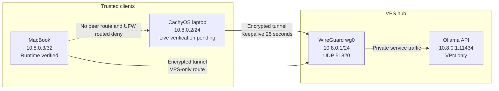

WireGuard creates Zero Five's private `10.8.0.0/24` network. The VPS is the
stable public hub; the CachyOS laptop and MacBook connect to it as clients.
Ollama traffic can therefore cross the internet inside an encrypted tunnel
without exposing the Ollama API publicly.

## Current state



| Machine | Address | Verification |
| --- | --- | --- |
| VPS | `10.8.0.1/24` | Runtime and reboot persistence verified |
| CachyOS laptop | `10.8.0.2/24` | Existing configuration documented; live re-verification pending |
| MacBook | `10.8.0.3/32` | Runtime and VPS persistence verified; Mac reboot activation pending |

The VPS uses `wg-quick@wg0.service`, which is enabled and active. Its UFW policy
allows UDP `51820` and traffic arriving on `wg0`, while the default routed
policy remains `deny`. Kernel IPv4 forwarding is enabled, but UFW prevents the
VPS from forwarding traffic between clients. The MacBook therefore cannot
reach the laptop through WireGuard.

## Why the VPS is the hub

The VPS has a stable public endpoint, while both clients may be behind NAT.
Each client needs only the VPS public key and endpoint. The VPS holds a separate
peer entry and `/32` route for each client.

This was chosen over a full mesh because it:

- adds or removes one client without distributing every peer to every device;
- keeps client-to-client access denied unless explicitly approved;
- behaves predictably when clients change networks or sit behind NAT;
- preserves the existing VPS-to-laptop Ollama connection.

The trade-off is an extra VPS hop if client-to-client routing is allowed later.
A direct peer can still be introduced for a measured need, but it should not be
the default.

## How WireGuard and Linux handle traffic

WireGuard creates a network interface and exchanges encrypted UDP packets. It
does not decide which applications may use the tunnel; the kernel routing table
and firewall do that.

`AllowedIPs` performs two jobs:

1. On outbound traffic, it selects the WireGuard peer for a destination.
2. On inbound traffic, it limits which source addresses are accepted from that
   peer.

Each peer uses a narrow `/32`, so this is not a full-tunnel VPN. Ordinary
internet traffic keeps using each client's normal default route.

`PersistentKeepalive = 25` on the laptop sends an authenticated empty packet
every 25 seconds. This keeps its NAT mapping available so the VPS can send
traffic back even when the laptop has been quiet.

`ollama-router` uses Docker host networking. It shares the VPS network namespace
and can use the host's `wg0` routes directly; no Docker port publication is
needed for the private Ollama path.

## Operational source

The tracked source is deliberately small:

| File | Purpose |
| --- | --- |
| `wireguard/vps.conf.example` | VPS interface and both client peers |
| `wireguard/cachyos-laptop.conf.example` | Laptop interface and VPS peer |
| `wireguard/macbook.conf.example` | Mac interface and VPS-only peer |
| `scripts/validate_wireguard.py` | Secret-safe structural and topology checks |

These are native WireGuard examples, not generated output. They contain public
keys because WireGuard needs them, but private keys are explicit placeholders.
Real files live on their machines with mode `0600` and never enter Git.

Run before using an example:

```bash
cd /Users/manuel/Desktop/zero-five/zero-five-infra
make validate
```

Validation does not prove that a tunnel is deployed or reachable. It proves
only that the tracked source is internally consistent and secret-free.

## Important configuration fields

| Field | Meaning |
| --- | --- |
| `Address` | IP assigned to the local WireGuard interface |
| `PrivateKey` | Local secret identity; it must stay on that machine |
| `ListenPort` | UDP port on which the VPS accepts handshakes |
| `PublicKey` | Identity of the remote peer |
| `Endpoint` | Public VPS address and UDP port used by a client |
| `AllowedIPs` | Peer selection for outgoing traffic and accepted source range for incoming traffic |
| `PersistentKeepalive` | Optional NAT mapping refresh interval |

## Inspect the running system

On the VPS:

```bash
sudo wg show
ip -brief address show wg0
ip route show dev wg0
sudo ss -lunp | grep 51820
systemctl status wg-quick@wg0 --no-pager
sudo ufw status verbose
sysctl net.ipv4.ip_forward
```

`wg show` reports public peer metadata, endpoint, handshake age, and counters;
it does not print the interface private key. Do not use `wg showconf` in copied
notes because complete configuration contains secrets.

A recent handshake proves cryptographic communication occurred. It does not by
itself prove application reachability, firewall permission, or persistence
after reboot.

## Failure modes

| Symptom | Likely checks |
| --- | --- |
| No handshake | Endpoint, UDP `51820`, public keys, NAT, client availability |
| Handshake but no ping | `AllowedIPs`, interface addresses, routes, UFW |
| VPS works but laptop Ollama fails | Laptop offline, stale tunnel, Ollama binding, laptop firewall |
| Works until reboot | `wg-quick@wg0` enablement and persistent config |
| Unrelated internet uses VPN | An accidentally broad client `AllowedIPs`, such as `0.0.0.0/0` |
| Clients can reach each other unexpectedly | Routed firewall policy or new forwarding rules |

## Security boundaries

- Private keys never leave their owning machine.
- Only WireGuard UDP `51820` is public for this tunnel.
- Ollama binds to WireGuard addresses and receives no public Traefik route.
- New clients peer only with the VPS unless a later decision permits more.
- The current broad UFW permission for traffic arriving on `wg0` should be
  narrowed before adding less-trusted peers.

## Safe recovery

Before changing `/etc/wireguard/wg0.conf`, keep two authenticated VPS sessions
open and create a root-only rollback copy:

```bash
sudo cp --preserve=all /etc/wireguard/wg0.conf \
  /etc/wireguard/wg0.conf.pre-change
sudo chmod 600 /etc/wireguard/wg0.conf.pre-change
```

For a new peer, change runtime state first with `wg set`, verify the existing
peers and services, and persist only after the runtime test succeeds. At the
first failure, remove only the new runtime peer. If the persistent file was
changed, restore the backup and restart `wg-quick@wg0` while the protected SSH
session remains open.

Never replace firewall, SSH, and WireGuard policy in the same change.
